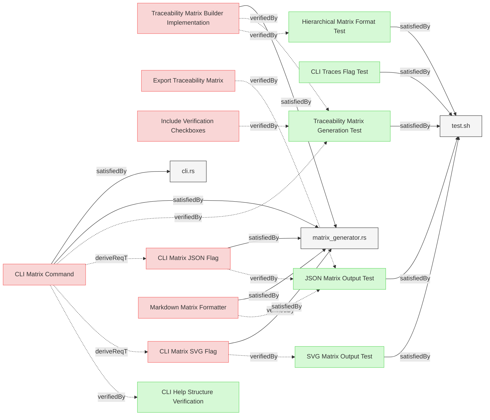

# Treacibility Matrix Verifications

This document contains treacibility matrix related verification tests.

## Traceability Matrix Verifications

### Traceability Matrix Generation Test

This test verifies that the system can generate a traceability matrix that accurately displays relationships between requirements and other elements.

#### Details

##### Acceptance Criteria
- System should generate a traceability matrix showing relationships between requirements and verification elements
- Matrix should organize requirements in a hierarchical structure
- Matrix should indicate verification status for each requirement
- Matrix should show relationships between requirements and verification elements

##### Test Criteria
- Command returns success (0) exit code
- Output contains a properly formatted matrix with requirements and verification elements
- Matrix includes hierarchy indicators for parent-child relationships
- Matrix includes verification status indicators (✅/❌)
- Matrix follows the specified format with proper table structure

#### Metadata
  * type: test-verification

#### Relations
  * verify: [Traceability Matrix Builder Implementation](../SystemRequirements/Requirements.md#traceability-matrix-builder-implementation)
  * verify: [Include Verification Checkboxes](../UserRequirements.md#include-verification-checkboxes)
  * satisfiedBy: [test.sh](../../tests/test-matrix-generation/test.sh)
---

### CLI Traces Flag Test

This test verifies that the system provides a command-line flag for generating traceability matrices.

#### Details

##### Acceptance Criteria
- System should provide a `--traces` flag for generating traceability matrices
- Command should execute without errors when the flag is used
- Output should be a properly formatted traceability matrix

##### Test Criteria
- Command with `--traces` flag returns success (0) exit code
- Command produces the expected traceability matrix output
- Help text includes documentation for the `--traces` flag

#### Metadata
  * type: test-verification

#### Relations
  * satisfiedBy: [test.sh](../../tests/test-matrix-generation/test.sh)
---

### SVG Matrix Output Test

This test verifies that the system can generate an SVG representation of the traceability matrix.

#### Details

##### Acceptance Criteria
- System should generate an SVG version of the traceability matrix when requested
- SVG should display full element names without truncation
- SVG should maintain hierarchical structure from the markdown matrix
- SVG should use appropriate visual indicators for verification status following the verification roll-up strategy
- Command should support both legacy `traces --svg` and new `traces --svg` formats

##### Test Criteria
- Command with `traces --svg` returns success (0) exit code
- Output is a valid SVG document
- Element names are displayed in full without truncation
- Hierarchical structure is preserved with visual indicators
- Verification status follows roll-up strategy:
  - Parent requirement with ALL children verified is marked as verified (✅)
  - Parent requirement with ANY child unverified is marked as unverified (❌)
  - Leaf requirement with direct verifiedBy relation is marked as verified (✅)
  - Leaf requirement without verifiedBy relation is marked as unverified (❌)

#### Metadata
  * type: test-verification

#### Relations
  * verify: [CLI Matrix SVG Flag](../SystemRequirements/Requirements.md#cli-matrix-svg-flag)
  * satisfiedBy: [test.sh](../../tests/test-matrix-generation/test.sh)
---

### Hierarchical Matrix Format Test

This test verifies that the traceability matrix properly represents the hierarchical relationships between requirements.

#### Details

##### Acceptance Criteria
- Matrix should organize requirements in a hierarchical structure
- Parent-child relationships should be visually indicated with indentation
- Requirements should be grouped by root requirements

##### Test Criteria
- Matrix output contains hierarchical organization
- Parent-child relationships are visually indicated with proper indentation
- Requirements are grouped by their root requirements

#### Metadata
  * type: test-verification

#### Relations
  * verify: [Traceability Matrix Builder Implementation](../SystemRequirements/Requirements.md#traceability-matrix-builder-implementation)
  * satisfiedBy: [test.sh](../../tests/test-matrix-generation/test.sh)
---

### JSON Matrix Output Test

This test verifies that the system can export the traceability matrix in a structured JSON format.

#### Details

##### Acceptance Criteria
- System should generate a JSON representation of the traceability matrix when requested
- JSON should include all information from the markdown matrix
- JSON should preserve hierarchical relationships
- JSON should use relative paths for element identifiers

##### Test Criteria
- Command with `--traces --json` flags returns success (0) exit code
- Output is valid JSON with required sections
- Hierarchical relationships are preserved in the JSON structure
- Element identifiers use relative paths

#### Metadata
  * type: test-verification

#### Relations
  * verify: [Markdown Matrix Formatter](../SystemRequirements/Requirements.md#markdown-matrix-formatter)
  * verify: [Export Traceability Matrix](../UserRequirements.md#export-traceability-matrix)
  * satisfiedBy: [test.sh](../../tests/test-matrix-generation/test.sh)
---