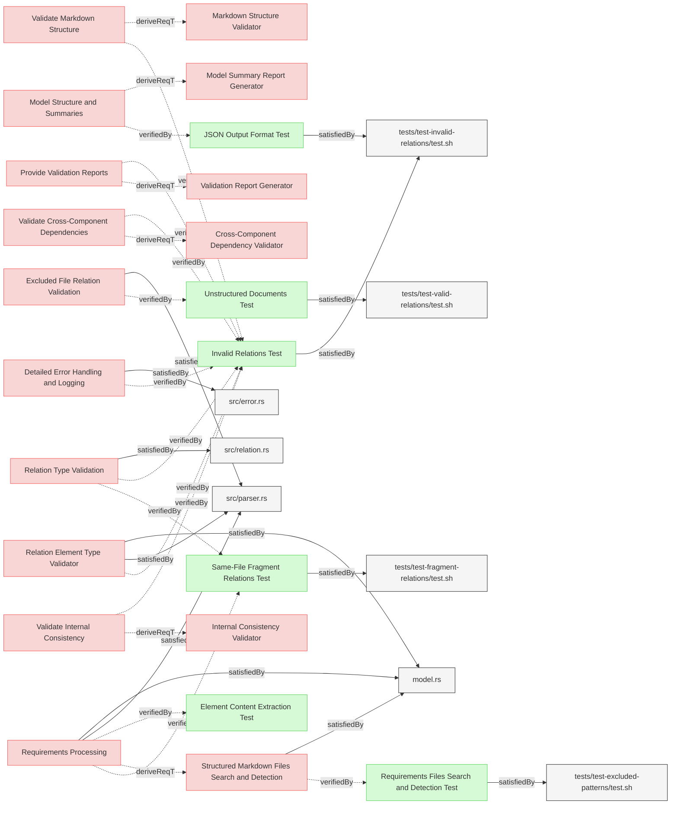
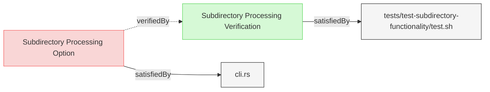

# Validation Tests

This document verifies the requirements for Reqvire's validation functionality.

## Relation Validation Tests

---

### Invalid Relations Test

The verification test checks that Reqvire correctly identifies and reports invalid relations of different kinds and provide validation report with expected details.

#### Metadata
  * type: verification

#### Details

##### Acceptance Criteria
- System should detect and report invalid relation types (typos, etc.)
- System should detect and report relations to non-existent targets
- System should detect and report requirement elements with satisfiedBy relations pointing to non-existing local files
- System should detect and report verification elements with satisfiedBy relations pointing to non-existing local files
- System should detect and report requirement elements with verifiedBy relations pointing to non-existing verification elements
- System should allow requirement elements with satisfiedBy relations pointing to existing implementation files
- System should allow verification elements with satisfiedBy relations pointing to existing test scripts
- System should detect and report requirement elements with satisfiedBy relations pointing to other requirement elements (incompatible types)
- System should detect and report verification elements with satisfiedBy relations pointing to other verification elements (incompatible types)
- System should detect and report if system requirement is missing parent relation
- System should detect and report if there is circular dependency in requirements
- System should detect and report if relation type has incompatible element
- System should detect and report invalid metadata subsection format
- System should detect and report duplicate relations in Relations subsection
- System should detect and report duplicate elements
- System should detect and report duplicate subsections
- System should report clear error messages with details about the invalid format

#### Test Criteria
- Command exits with 0 error code but outputs expected validation errors
- Error output contains specific error messages for each type of invalid relation

#### Relations
  * verify: [SystemRequirements/Requirement.md/Detailed Error Handling and Logging](../SystemRequirements/Requirements.md#detailed-error-handling-and-logging)
  * verify: [SystemRequirements/Requirement.md/Relation Type Validation](../SystemRequirements/Requirements.md#relation-type-validation)  
  * verify: [SystemRequirements/Requirement.md/Relation Element Type Validator](../SystemRequirements/Requirements.md#relation-element-type-validator)  
  * verify: [UserRequirements.md/Validate Markdown Structure](../UserRequirements.md#validate-markdown-structure)  
  * verify: [UserRequirements.md/Validate Internal Consistency](../UserRequirements.md#validate-internal-consistency)
  * verify: [UserRequirements.md/Validate Cross-Component Dependencies](../UserRequirements.md#validate-cross-component-dependencies)      
  * verify: [UserRequirements.md/Provide Validation Reports](../UserRequirements.md#provide-validation-reports)  
  * satisfiedBy: [tests/test-invalid-relations/test.sh](../../tests/test-invalid-relations/test.sh)

---

### Same-File Fragment Relations Test

This test verifies that Reqvire correctly handles and validates relations to fragments within the same file.

#### Metadata
  * type: verification

#### Details

##### Acceptance Criteria
- System should correctly validate relations to fragments within the same file
- System should not report errors for valid fragment references
- System should handle both fragment-only references like "#fragment-id" and proper element IDs

##### Test Criteria
- Command exits with success (zero) return code
- No error output about missing relation targets when using #fragment references
- Successful validation message is displayed

#### Relations
  * verify: [SystemRequirements/Requirements.md#Relation Type Validation](../SystemRequirements/Requirements.md#relation-type-validation)
  * verify: [SystemRequirements/Requirements.md#Requirements Processing](../SystemRequirements/Requirements.md#requirements-processing)
  * satisfiedBy: [tests/test-fragment-relations/test.sh](../../tests/test-fragment-relations/test.sh)

---

### JSON Output Format Test

This test verifies that the system properly implements JSON output formatting for validation and other commands.

#### Metadata
  * type: verification

#### Details

##### Acceptance Criteria
- System shall support --json flag for validation commands
- JSON output shall be properly formatted according to a consistent schema
- JSON structure shall be parsable and machine-readable
- All relevant validation data shall be included in the output

##### Test Criteria
- Commands with --json flag produce valid JSON
- JSON output can be parsed without errors
- Output structure matches expected schema
- All validation errors are properly represented in JSON format

#### Relations
  * verify: [../UserRequirements.md#model-structure-and-summaries](../UserRequirements.md#model-structure-and-summaries)
  * satisfiedBy: [tests/test-invalid-relations/test.sh](../../tests/test-invalid-relations/test.sh)

---

### Requirements Files Search and Detection Test

This test verifies that the system correctly searches for and detects structured document files according to specified patterns and configurations.

#### Metadata
  * type: verification

#### Details

##### Acceptance Criteria
- System shall find all structured document files in project structure based on configuration
- System shall respect excluded file patterns defined in configuration
- System shall handle nested directory structures correctly
- System shall correctly identify and categorize different file types

##### Test Criteria
- All expected requirements files are identified
- Files matching exclusion patterns are skipped
- Nested directories are correctly traversed
- Non-markdown files are handled appropriately

#### Relations
  * verify: [SystemRequirements/Requirements.md#structured-markdown-files-search-and-detection](../SystemRequirements/Requirements.md#structured-markdown-files-search-and-detection)
  * satisfiedBy: [tests/test-excluded-patterns/test.sh](../../tests/test-excluded-patterns/test.sh)

---

### Unstructured Documents Test

This test verifies that the system correctly validates relations to excluded files.

#### Metadata
  * type: verification

#### Details

##### Acceptance Criteria
- System shall allow referencing unstructured documents (text files, code files)
- System shall not attempt to parse unstructured documents as requirements
- System shall validate that referenced unstructured documents exist
- System shall not report validation errors for valid references to unstructured documents

##### Test Criteria
- Relations referencing unstructured documents are treated as valid
- No attempt is made to extract elements from unstructured documents
- Validation succeeds when referenced unstructured documents exist
- Validation fails when referenced unstructured documents don't exist

#### Relations
  * verify: [SystemRequirements/Requirements.md#Excluded File Relation Validation](../SystemRequirements/Requirements.md#excluded-file-relation-validation)
  * satisfiedBy: [tests/test-valid-relations/test.sh](../../tests/test-valid-relations/test.sh)

---

## Validation Report Tests

---

### Subdirectory Processing Verification

This test verifies that the system correctly processes only files within the current directory when run from a subfolder of a git repository.

#### Metadata
  * type: verification

#### Details

##### Acceptance Criteria
- System shall process only files within the current directory when run from a subfolder
- System shall handle identifier normalization correctly within subdirectory context  
- System shall validate cross-references correctly even when they point outside current directory
- System shall work with validate, model-summary, html, lint, and traces commands
- System shall ignore files outside the current directory scope
- System shall provide meaningful error messages for invalid cross-references

##### Test Criteria
- Commands run from subdirectory process only files within that subdirectory
- Files outside the current directory are not included in processing or output
- Identifier normalization works correctly for paths within subdirectory
- Cross-references to files outside current directory are handled gracefully
- All major commands (validate, model-summary, html, lint, traces) work from subdirectories
- Commands exit with success (0) return code when subdirectory processing works correctly
- Error messages are clear when identifier normalization fails for cross-references

#### Relations
  * verify: [SystemRequirements/Requirements.md/Subdirectory Processing Option](../SystemRequirements/Requirements.md#subdirectory-processing-option)
  * satisfiedBy: [tests/test-subdirectory-functionality/test.sh](../../tests/test-subdirectory-functionality/test.sh)

---