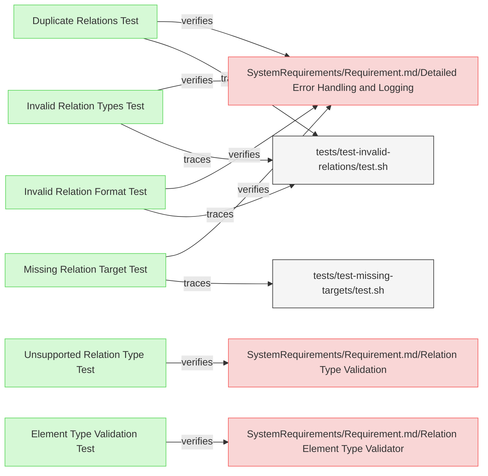

# Validation Tests
This document verifies the requirements for ReqFlow's validation functionality.

## Relation Validation Tests

---

### Unsupported Relation Type Test
This verification test checks that ReqFlow correctly identifies and reports relation types that are not part of the supported vocabulary (e.g., "satisfieddBy" instead of "satisfiedBy").

#### Metadata
  * type: verification

#### Acceptance Criteria
- System should detect and report relation types that are not in the supported vocabulary
- System should provide clear error messages suggesting the closest valid relation type

#### Test Criteria
- Command exits with error (non-zero) return code
- Error output contains specific error messages about unsupported relation types
- Error message suggests possible correct relation types

#### Test Procedure
1. Create a test fixture with requirements containing unsupported relation types (e.g., "satisfieddBy", "basedFrom")
2. Run ReqFlow validation on the test fixture
3. Verify that the validation reports an error for the unsupported relation types
4. Verify that error messages suggest the correct relation types (e.g., "satisfiedBy", "derivedFrom")

#### Implementation
- Test will be implemented in `/tests/test-unsupported-relations/test.sh`

#### Relations
  * verify: [SystemRequirements/Requirement.md/Relation Type Validation](../SystemRequirements/Requirements.md#relation-type-validation)

---

### Invalid Relation Types Test
The verification test checks that ReqFlow correctly identifies and reports invalid relation types such as typos (e.g., "satisfieddBy" instead of "satisfiedBy").

#### Metadata
  * type: verification

#### Acceptance Criteria
- System should detect and report invalid relation types (typos, etc.)
- System should report clear error messages with details about the invalid format

#### Test Criteria
- Command exits with error (non-zero) return code
- Error output contains specific error messages about the invalid relation types

#### Test Procedure
1. Create a test fixture in `/tests/fixtures/test-invalid-relations/` with requirements containing invalid relation types
2. Run ReqFlow validation on the test fixture
3. Verify that the validation reports an error for the invalid relation types
4. Verify that error messages contain details about the specific typos found

#### Relations
  * verify: [SystemRequirements/Requirement.md/Detailed Error Handling and Logging](../SystemRequirements/Requirements.md#detailed-error-handling-and-logging)
  * trace: [tests/test-invalid-relations/test.sh](../../tests/test-invalid-relations/test.sh)

---

### Invalid Relation Format Test
The verification test checks that ReqFlow correctly identifies and reports relation types with invalid formats (e.g., containing non-alphanumeric characters).

#### Metadata
  * type: verification

#### Acceptance Criteria
- System should detect and report relation types with non-alphanumeric characters
- System should report clear error messages about allowed relation type format

#### Test Criteria
- Command exits with error (non-zero) return code
- Error output contains specific error messages about the invalid characters in relation types

#### Test Procedure
1. Create a test fixture in `/tests/fixtures/test-invalid-relations/` with requirements containing relations with non-alphanumeric characters
2. Run ReqFlow validation on the test fixture
3. Verify that the validation reports an error for the invalid format
4. Verify that error messages indicate what characters are not allowed

#### Relations
  * verify: [SystemRequirements/Requirement.md/Detailed Error Handling and Logging](../SystemRequirements/Requirements.md#detailed-error-handling-and-logging)
  * trace: [tests/test-invalid-relations/test.sh](../../tests/test-invalid-relations/test.sh)

---

### Duplicate Relations Test
The verification test checks that ReqFlow correctly identifies and reports duplicate relations (same type and target) within an element.

#### Metadata
  * type: verification

#### Acceptance Criteria
- System should detect and report duplicate relations within the same element
- System should clearly identify which relations are duplicated and where they occur

#### Test Criteria
- Command exits with error (non-zero) return code
- Error output contains specific error messages identifying duplicate relations
- Error messages include element name and relation indices

#### Test Procedure
1. Create a test fixture in `/tests/fixtures/test-invalid-relations/` with requirements containing duplicate relations
2. Run ReqFlow validation on the test fixture
3. Verify that the validation reports an error for the duplicates
4. Verify that error messages identify which relations are duplicated

#### Relations
  * verify: [SystemRequirements/Requirement.md/Detailed Error Handling and Logging](../SystemRequirements/Requirements.md#detailed-error-handling-and-logging)
  * trace: [tests/test-invalid-relations/test.sh](../../tests/test-invalid-relations/test.sh)

---

### Missing Relation Target Test
The verification test checks that ReqFlow correctly identifies and reports relations with targets that do not exist in the model, while properly validating relations to existing targets.

#### Metadata
  * type: verification

#### Acceptance Criteria
- System should detect and report relations to non-existent targets
- System should provide clear error messages identifying the missing targets
- System should properly validate relations in both standard and markdown link formats
- System should correctly validate valid relations to existing targets
- System should extract target URLs from markdown links for validation

#### Test Criteria
- Command exits with error (non-zero) return code when there are invalid targets
- Command exits with success (zero) return code when all targets are valid
- Error output contains specific error messages about the missing relation targets
- Error messages include both source element and target information
- No errors reported for valid relations to existing targets

#### Test Procedure
1. Create a test fixture in `/tests/fixtures/test-missing-targets/` with requirements containing:
   - Relations to non-existent elements in standard format 
   - Relations to non-existent targets in markdown link format
   - Relations to existing elements in standard format
   - Relations to existing elements in markdown link format
2. Run ReqFlow validation on the test fixture
3. Verify that the validation reports errors only for the missing targets
4. Verify that error messages clearly identify which targets are missing
5. Create a fixture with only valid relations and verify validation passes

#### Implementation
- Test is implemented in `/tests/test-missing-targets/test.sh`
- Test for valid targets is implemented in `/tests/test-valid-relations/test.sh`

#### Relations
  * verify: [SystemRequirements/Requirement.md/Detailed Error Handling and Logging](../SystemRequirements/Requirements.md#detailed-error-handling-and-logging)
  * trace: [tests/test-missing-targets/test.sh](../../tests/test-missing-targets/test.sh)
  
---

### Element Type Validation Test
The verification test checks that ReqFlow correctly validates relation types against the element types they connect, ensuring that relations like verifiedBy/verify and satisfiedBy/satisfy connect appropriate element types.

#### Metadata
  * type: verification

#### Acceptance Criteria
- System should validate that verifiedBy/verify relations connect requirements and verification elements
- System should validate that satisfiedBy/satisfy relations connect requirements and implementation elements
- System should report validation errors for incompatible element types in relations
- System should return success exit code (0) despite validation errors for element type incompatibilities

#### Test Criteria
- Command exits with success (zero) return code even when there are element type validation errors
- Validation output contains specific error messages about incompatible element types for relations
- Model processing continues despite element type validation errors

#### Test Procedure
1. Create a test fixture with the following scenarios:
   - Requirement with verifiedBy relation to verification element (valid)
   - Verification element with verify relation to requirement (valid)
   - Requirement with verifiedBy relation to non-verification element (error but non-blocking)
   - Verification element with verify relation to non-requirement element (error but non-blocking)
   - Requirement with satisfiedBy relation to implementation element (valid)
   - Implementation element with satisfy relation to requirement (valid)
   - Other relation types connecting various element types (no validation)
2. Run ReqFlow validation on the test fixture
3. Verify that the validation reports errors for incompatible relation element types
4. Verify that the command still completes successfully with exit code 0
5. Verify that all other model processing continues despite the element type validation errors

#### Implementation
- Test will be implemented in `/tests/test-relation-element-validation/test.sh`

#### Relations
  * verify: [SystemRequirements/Requirement.md/Relation Element Type Validator](../SystemRequirements/Requirements.md#relation-element-type-validator)