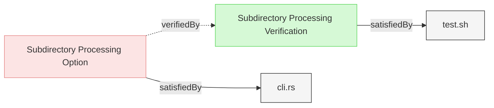

# Validation Tests

This document verifies the requirements for Reqvire's validation functionality.

## Relation Validation Tests

```mermaid
graph LR;
  %% REQVIRE-AUTOGENERATED-DIAGRAM
  %% Graph styling
  classDef userRequirement fill:#f9d6d6,stroke:#f55f5f,stroke-width:1px;
  classDef systemRequirement fill:#fce4e4,stroke:#e68a8a,stroke-width:1px;
  classDef verification fill:#d6f9d6,stroke:#5fd75f,stroke-width:1px;
  classDef default fill:#f5f5f5,stroke:#333333,stroke-width:1px;

  55e6d839dbcc7077["File Exclusion Test"];
  class 55e6d839dbcc7077 verification;
  click 55e6d839dbcc7077 "ValidationTests.md#file-exclusion-test";
  7f5e53340a03365f["test.sh"];
  class 7f5e53340a03365f default;
  click 7f5e53340a03365f "../../tests/test-gitignore-integration/test.sh";
  55e6d839dbcc7077 -->|satisfiedBy| 7f5e53340a03365f;
  e37dc7f46d75d46["Invalid Relations Test"];
  class e37dc7f46d75d46 verification;
  click e37dc7f46d75d46 "ValidationTests.md#invalid-relations-test";
  8b8c9b79dcbe085e["test.sh"];
  class 8b8c9b79dcbe085e default;
  click 8b8c9b79dcbe085e "../../tests/test-invalid-relations/test.sh";
  e37dc7f46d75d46 -->|satisfiedBy| 8b8c9b79dcbe085e;
  9a53e9c00918fd02["JSON Output Format Test"];
  class 9a53e9c00918fd02 verification;
  click 9a53e9c00918fd02 "ValidationTests.md#json-output-format-test";
  6ca2ff1567644e78["Same-File Fragment Relations Test"];
  class 6ca2ff1567644e78 verification;
  click 6ca2ff1567644e78 "ValidationTests.md#same-file-fragment-relations-test";
  789c690d63402d63["test.sh"];
  class 789c690d63402d63 default;
  click 789c690d63402d63 "../../tests/test-fragment-relations/test.sh";
  6ca2ff1567644e78 -->|satisfiedBy| 789c690d63402d63;
  526fb26c223ad188["Unstructured Documents Test"];
  class 526fb26c223ad188 verification;
  click 526fb26c223ad188 "ValidationTests.md#unstructured-documents-test";
  b91bd280b4e9971["test.sh"];
  class b91bd280b4e9971 default;
  click b91bd280b4e9971 "../../tests/test-valid-relations/test.sh";
  526fb26c223ad188 -->|satisfiedBy| b91bd280b4e9971;
  b0d0999636b025fa["Invalid Header Structure Test"];
  class b0d0999636b025fa verification;
  click b0d0999636b025fa "ValidationTests.md#invalid-header-structure-test";
  8b8c9b79dcbe085e["test.sh"];
  class 8b8c9b79dcbe085e default;
  click 8b8c9b79dcbe085e "../../tests/test-invalid-relations/test.sh";
  b0d0999636b025fa -->|satisfiedBy| 8b8c9b79dcbe085e;
  184bc01c18f5506f["Requirements Files Search and Detection Test"];
  class 184bc01c18f5506f verification;
  click 184bc01c18f5506f "ValidationTests.md#requirements-files-search-and-detection-test";
  a29e69e90fa71f39["test.sh"];
  class a29e69e90fa71f39 default;
  click a29e69e90fa71f39 "../../tests/test-excluded-patterns/test.sh";
  184bc01c18f5506f -->|satisfiedBy| a29e69e90fa71f39;
  b49d890e0bbe0a83["Structure of Markdown Documents"];
  class b49d890e0bbe0a83 userRequirement;
  click b49d890e0bbe0a83 "../SpecificationsRequirements.md#structure-of-markdown-documents";
  9450d4313f47ef36["relation.rs"];
  class 9450d4313f47ef36 default;
  click 9450d4313f47ef36 "../../core/src/relation.rs";
  b49d890e0bbe0a83 -->|satisfiedBy| 9450d4313f47ef36;
  a814c4935e1a0449["element.rs"];
  class a814c4935e1a0449 default;
  click a814c4935e1a0449 "../../core/src/element.rs";
  b49d890e0bbe0a83 -->|satisfiedBy| a814c4935e1a0449;
  398003c91b6b2cde["subsection.rs"];
  class 398003c91b6b2cde default;
  click 398003c91b6b2cde "../../core/src/subsection.rs";
  b49d890e0bbe0a83 -->|satisfiedBy| 398003c91b6b2cde;
  f22d93285fcd7664["parser.rs"];
  class f22d93285fcd7664 default;
  click f22d93285fcd7664 "../../core/src/parser.rs";
  b49d890e0bbe0a83 -->|satisfiedBy| f22d93285fcd7664;
  d50a859650933e55["model.rs"];
  class d50a859650933e55 default;
  click d50a859650933e55 "../../core/src/model.rs";
  b49d890e0bbe0a83 -->|satisfiedBy| d50a859650933e55;
  735766802775ec41["Format Command Requirements Verification"];
  class 735766802775ec41 verification;
  click 735766802775ec41 "Misc.md#format-command-requirements-verification";
  b49d890e0bbe0a83 -.->|verifiedBy| 735766802775ec41;
  b49d890e0bbe0a83 -.->|verifiedBy| b0d0999636b025fa;
  db64a3e25646a37f["Relation Type Validation"];
  class db64a3e25646a37f systemRequirement;
  click db64a3e25646a37f "../SystemRequirements/Requirements.md#relation-type-validation";
  9450d4313f47ef36["relation.rs"];
  class 9450d4313f47ef36 default;
  click 9450d4313f47ef36 "../../core/src/relation.rs";
  db64a3e25646a37f -->|satisfiedBy| 9450d4313f47ef36;
  db64a3e25646a37f -.->|verifiedBy| e37dc7f46d75d46;
  db64a3e25646a37f -.->|verifiedBy| 6ca2ff1567644e78;
  929c6c204cb3fedb["Excluded File Relation Validation"];
  class 929c6c204cb3fedb systemRequirement;
  click 929c6c204cb3fedb "../SystemRequirements/Requirements.md#excluded-file-relation-validation";
  f22d93285fcd7664["parser.rs"];
  class f22d93285fcd7664 default;
  click f22d93285fcd7664 "../../core/src/parser.rs";
  929c6c204cb3fedb -->|satisfiedBy| f22d93285fcd7664;
  929c6c204cb3fedb -.->|verifiedBy| 526fb26c223ad188;
  7de12ce482cb509["Validation Error Handling"];
  class 7de12ce482cb509 systemRequirement;
  click 7de12ce482cb509 "../SystemRequirements/TwoPassValidation.md#validation-error-handling";
  a581221890d15c0c["error.rs"];
  class a581221890d15c0c default;
  click a581221890d15c0c "../../core/src/error.rs";
  7de12ce482cb509 -->|satisfiedBy| a581221890d15c0c;
  d50a859650933e55["model.rs"];
  class d50a859650933e55 default;
  click d50a859650933e55 "../../core/src/model.rs";
  7de12ce482cb509 -->|satisfiedBy| d50a859650933e55;
  7de12ce482cb509 -.->|verifiedBy| e37dc7f46d75d46;
  83a57a249c4322b8["Ignore Files Integration"];
  class 83a57a249c4322b8 systemRequirement;
  click 83a57a249c4322b8 "../SystemRequirements/Requirements.md#ignore-files-integration";
  8419dcc77d92b609["config.rs"];
  class 8419dcc77d92b609 default;
  click 8419dcc77d92b609 "../../cli/src/config.rs";
  83a57a249c4322b8 -->|satisfiedBy| 8419dcc77d92b609;
  83a57a249c4322b8 -.->|verifiedBy| 55e6d839dbcc7077;
  b4f1757fc8831083["Validate Command"];
  class b4f1757fc8831083 systemRequirement;
  click b4f1757fc8831083 "../SystemRequirements/Requirements.md#validate-command";
  80defdd4cbc7ee18["cli.rs"];
  class 80defdd4cbc7ee18 default;
  click 80defdd4cbc7ee18 "../../cli/src/cli.rs";
  b4f1757fc8831083 -->|satisfiedBy| 80defdd4cbc7ee18;
  b4f1757fc8831083 -.->|verifiedBy| e37dc7f46d75d46;
  34c75e4a88e1f381["CLI Help Structure Verification"];
  class 34c75e4a88e1f381 verification;
  click 34c75e4a88e1f381 "Misc.md#cli-help-structure-verification";
  b4f1757fc8831083 -.->|verifiedBy| 34c75e4a88e1f381;
  80aa3982504aea7b["Cross-Component Dependency Validator"];
  class 80aa3982504aea7b systemRequirement;
  click 80aa3982504aea7b "../SystemRequirements/Requirements.md#cross-component-dependency-validator";
  d50a859650933e55["model.rs"];
  class d50a859650933e55 default;
  click d50a859650933e55 "../../core/src/model.rs";
  80aa3982504aea7b -->|satisfiedBy| d50a859650933e55;
  f22d93285fcd7664["parser.rs"];
  class f22d93285fcd7664 default;
  click f22d93285fcd7664 "../../core/src/parser.rs";
  80aa3982504aea7b -->|satisfiedBy| f22d93285fcd7664;
  80aa3982504aea7b -.->|verifiedBy| e37dc7f46d75d46;
  dc7a9bb1bbebc57f["Relation Element Type Validator"];
  class dc7a9bb1bbebc57f systemRequirement;
  click dc7a9bb1bbebc57f "../SystemRequirements/Requirements.md#relation-element-type-validator";
  d50a859650933e55["model.rs"];
  class d50a859650933e55 default;
  click d50a859650933e55 "../../core/src/model.rs";
  dc7a9bb1bbebc57f -->|satisfiedBy| d50a859650933e55;
  f22d93285fcd7664["parser.rs"];
  class f22d93285fcd7664 default;
  click f22d93285fcd7664 "../../core/src/parser.rs";
  dc7a9bb1bbebc57f -->|satisfiedBy| f22d93285fcd7664;
  dc7a9bb1bbebc57f -.->|verifiedBy| e37dc7f46d75d46;
  9d7ad0f9a306af77["Markdown Structure Validator"];
  class 9d7ad0f9a306af77 systemRequirement;
  click 9d7ad0f9a306af77 "../SystemRequirements/Requirements.md#markdown-structure-validator";
  d50a859650933e55["model.rs"];
  class d50a859650933e55 default;
  click d50a859650933e55 "../../core/src/model.rs";
  9d7ad0f9a306af77 -->|satisfiedBy| d50a859650933e55;
  f22d93285fcd7664["parser.rs"];
  class f22d93285fcd7664 default;
  click f22d93285fcd7664 "../../core/src/parser.rs";
  9d7ad0f9a306af77 -->|satisfiedBy| f22d93285fcd7664;
  9d7ad0f9a306af77 -.->|verifiedBy| e37dc7f46d75d46;
  9d7ad0f9a306af77 -.->|verifiedBy| b0d0999636b025fa;
  816c1e0b1de4dc53["Identifiers and Relations"];
  class 816c1e0b1de4dc53 userRequirement;
  click 816c1e0b1de4dc53 "../SpecificationsRequirements.md#identifiers-and-relations";
  9450d4313f47ef36["relation.rs"];
  class 9450d4313f47ef36 default;
  click 9450d4313f47ef36 "../../core/src/relation.rs";
  816c1e0b1de4dc53 -->|satisfiedBy| 9450d4313f47ef36;
  816c1e0b1de4dc53 -.->|verifiedBy| e37dc7f46d75d46;
  5a41848d39d13522["Trace Relation Non-Directional Behavior"];
  class 5a41848d39d13522 systemRequirement;
  click 5a41848d39d13522 "../SystemRequirements/Requirements.md#trace-relation-non-directional-behavior";
  5a41848d39d13522 -.->|verifiedBy| e37dc7f46d75d46;
  96a12d4873ff83a0["Trace Relations No Cycles Verification"];
  class 96a12d4873ff83a0 verification;
  click 96a12d4873ff83a0 "TraceRelationTests.md#trace-relations-no-cycles-verification";
  5a41848d39d13522 -.->|verifiedBy| 96a12d4873ff83a0;
  ac1ef28df8af0894["Reserved Repository Files Exclusion"];
  class ac1ef28df8af0894 systemRequirement;
  click ac1ef28df8af0894 "../SystemRequirements/Requirements.md#reserved-repository-files-exclusion";
  8419dcc77d92b609["config.rs"];
  class 8419dcc77d92b609 default;
  click 8419dcc77d92b609 "../../cli/src/config.rs";
  ac1ef28df8af0894 -->|satisfiedBy| 8419dcc77d92b609;
  ac1ef28df8af0894 -.->|verifiedBy| 55e6d839dbcc7077;
  66582f9b6bdde6c4["Structured Markdown Files Search and Detection"];
  class 66582f9b6bdde6c4 systemRequirement;
  click 66582f9b6bdde6c4 "../SystemRequirements/Requirements.md#structured-markdown-files-search-and-detection";
  d50a859650933e55["model.rs"];
  class d50a859650933e55 default;
  click d50a859650933e55 "../../core/src/model.rs";
  66582f9b6bdde6c4 -->|satisfiedBy| d50a859650933e55;
  66582f9b6bdde6c4 -.->|verifiedBy| 184bc01c18f5506f;
  bcf308e253d2c6e7["Internal Consistency Validator"];
  class bcf308e253d2c6e7 systemRequirement;
  click bcf308e253d2c6e7 "../SystemRequirements/Requirements.md#internal-consistency-validator";
  d50a859650933e55["model.rs"];
  class d50a859650933e55 default;
  click d50a859650933e55 "../../core/src/model.rs";
  bcf308e253d2c6e7 -->|satisfiedBy| d50a859650933e55;
  f22d93285fcd7664["parser.rs"];
  class f22d93285fcd7664 default;
  click f22d93285fcd7664 "../../core/src/parser.rs";
  bcf308e253d2c6e7 -->|satisfiedBy| f22d93285fcd7664;
  bcf308e253d2c6e7 -.->|verifiedBy| e37dc7f46d75d46;
  bed8d0948b3e5ccd["Requirements Processing"];
  class bed8d0948b3e5ccd systemRequirement;
  click bed8d0948b3e5ccd "../SystemRequirements/Requirements.md#requirements-processing";
  d50a859650933e55["model.rs"];
  class d50a859650933e55 default;
  click d50a859650933e55 "../../core/src/model.rs";
  bed8d0948b3e5ccd -->|satisfiedBy| d50a859650933e55;
  f22d93285fcd7664["parser.rs"];
  class f22d93285fcd7664 default;
  click f22d93285fcd7664 "../../core/src/parser.rs";
  bed8d0948b3e5ccd -->|satisfiedBy| f22d93285fcd7664;
  a4090fe7e30eeae4["Element Content Extraction Test"];
  class a4090fe7e30eeae4 verification;
  click a4090fe7e30eeae4 "ChangeImpactTests.md#element-content-extraction-test";
  bed8d0948b3e5ccd -.->|verifiedBy| a4090fe7e30eeae4;
  bed8d0948b3e5ccd -.->|deriveReqT| 66582f9b6bdde6c4;
  c3b9530980b77cba["GraphRegistry as Primary Registry"];
  class c3b9530980b77cba systemRequirement;
  click c3b9530980b77cba "../SystemRequirements/TwoPassValidation.md#graphregistry-as-primary-registry";
  bed8d0948b3e5ccd -.->|deriveReqT| c3b9530980b77cba;
  bed8d0948b3e5ccd -.->|verifiedBy| 6ca2ff1567644e78;
  c0cc52075c4770f2["Two-Pass Validation Strategy"];
  class c0cc52075c4770f2 systemRequirement;
  click c0cc52075c4770f2 "../SystemRequirements/TwoPassValidation.md#two-pass-validation-strategy";
  bed8d0948b3e5ccd -.->|deriveReqT| c0cc52075c4770f2;
  b7c871ab64a7059a["graph_registry.rs"];
  class b7c871ab64a7059a default;
  click b7c871ab64a7059a "../../core/src/graph_registry.rs";
  c3b9530980b77cba -->|satisfiedBy| b7c871ab64a7059a;
  d50a859650933e55["model.rs"];
  class d50a859650933e55 default;
  click d50a859650933e55 "../../core/src/model.rs";
  c3b9530980b77cba -->|satisfiedBy| d50a859650933e55;
  c3b9530980b77cba -.->|verifiedBy| 184bc01c18f5506f;
```

### Invalid Relations Test

This verification test checks that Reqvire correctly identifies and reports invalid relations using the two-pass validation architecture, separating parsing errors (Pass 1) from relation validation errors (Pass 2). The test also verifies the validate command functionality.

#### Details
- Pass 1 test: Command exits with non-zero error code and outputs expected parsing/format validation errors
- Pass 2 test: Command exits with non-zero error code and outputs expected relation validation errors
- Error output contains specific error messages for each type of validation error in the appropriate pass
- Validate command test: Verify the validate command executes validation and reports issues correctly

##### Acceptance Criteria
**Validate Command Requirements:**
- System should provide a validate command that executes model validation
- Validate command should output "No validation issues found" when the model is valid
- Validate command should report all validation errors when the model has issues
- Validate command should support --json flag for JSON formatted output
- Validate command should not modify any files during validation
- Validate command should use the same validation logic as other commands that load the model

**Pass 1 Validation Errors (Element Collection and Local Validation):**
- System should detect and report duplicate elements in the same document
- System should detect and report invalid metadata subsection format
- System should detect and report invalid relation format syntax
- System should detect and report invalid relation types (typos, etc.)
- System should detect and report duplicate subsections within elements
- Pass 1 errors should prevent Pass 2 from executing

**Pass 2 Validation Errors (Graph Construction and Relation Validation):**
- System should detect and report relations to non-existent targets
- System should detect and report requirement elements with satisfiedBy relations pointing to non-existing local files
- System should detect and report verification elements with satisfiedBy relations pointing to non-existing local files
- System should detect and report requirement elements with verifiedBy relations pointing to non-existing verification elements
- System should detect and report requirement elements with satisfiedBy relations pointing to other requirement elements (incompatible types)
- System should detect and report verification elements with satisfiedBy relations pointing to other verification elements (incompatible types)
- System should detect and report non-test-verification elements with satisfiedBy relations (only test-verification may use satisfiedBy, trace is always allowed)
- System should detect and report if system requirement is missing parent relation
- System should detect and report if there is circular dependency in requirements
- Pass 2 validation should only execute when Pass 1 completes without errors

**General Requirements:**
- System should allow requirement elements with satisfiedBy relations pointing to existing implementation files
- System should allow test-verification elements with satisfiedBy relations pointing to existing test scripts
- System should report clear error messages with details about the invalid format
- Two separate test scenarios should validate Pass 1 and Pass 2 errors independently

#### Metadata
  * type: test-verification

#### Relations
  * verify: [Validate Command](../SystemRequirements/Requirements.md#validate-command)
  * verify: [Validation Error Handling](../SystemRequirements/TwoPassValidation.md#validation-error-handling)
  * verify: [Relation Type Validation](../SystemRequirements/Requirements.md#relation-type-validation)
  * verify: [Relation Element Type Validator](../SystemRequirements/Requirements.md#relation-element-type-validator)
  * verify: [Identifiers and Relations](../SpecificationsRequirements.md#identifiers-and-relations)
  * verify: [Trace Relation Non-Directional Behavior](../SystemRequirements/Requirements.md#trace-relation-non-directional-behavior)
  * satisfiedBy: [test.sh](../../tests/test-invalid-relations/test.sh)
---

### Same-File Fragment Relations Test

This test verifies that Reqvire correctly handles and validates relations to fragments within the same file.

#### Details

##### Acceptance Criteria
- System should correctly validate relations to fragments within the same file
- System should not report errors for valid fragment references
- System should handle both fragment-only references like "#fragment-id" and proper element IDs

##### Test Criteria
- Command exits with success (zero) return code
- No error output about missing relation targets when using #fragment references
- Successful validation message is displayed

#### Metadata
  * type: test-verification

#### Relations
  * verify: [Relation Type Validation](../SystemRequirements/Requirements.md#relation-type-validation)
  * verify: [Requirements Processing](../SystemRequirements/Requirements.md#requirements-processing)
  * satisfiedBy: [test.sh](../../tests/test-fragment-relations/test.sh)
---

### JSON Output Format Test

This test verifies that the system properly implements JSON output formatting for various commands that require it.

#### Details

##### Acceptance Criteria
- System shall support --json flag for various commands
- JSON output shall be properly formatted according to a consistent schema
- JSON structure shall be parsable and machine-readable

##### Test Criteria
- Commands with --json flag produce valid JSON
- JSON output can be parsed without errors
- Output structure matches expected schema

#### Metadata
  * type: test-verification
---

### Requirements Files Search and Detection Test

This test verifies that the system correctly searches for and detects structured document files according to specified patterns.

#### Details

##### Acceptance Criteria
- System shall find all structured document files in project structure
- System shall respect excluded file patterns defined in .gitignore and .reqvireignore files
- System shall handle nested directory structures correctly
- System shall correctly identify and categorize different file types

##### Test Criteria
- All expected requirements files are identified
- Files matching exclusion patterns are skipped
- Nested directories are correctly traversed
- Non-markdown files are handled appropriately

#### Metadata
  * type: test-verification

#### Relations
  * verify: [Structured Markdown Files Search and Detection](../SystemRequirements/Requirements.md#structured-markdown-files-search-and-detection)
  * satisfiedBy: [test.sh](../../tests/test-excluded-patterns/test.sh)
---

### File Exclusion Test

This test verifies that Reqvire correctly reads and applies exclusion patterns from the repository root .gitignore file, .reqvireignore file, and reserved filenames.

#### Details

##### Acceptance Criteria
- System shall read exclusion patterns from root .gitignore file
- System shall read exclusion patterns from root .reqvireignore file
- System shall automatically exclude reserved repository documentation files
- System shall combine patterns from .gitignore, .reqvireignore, and reserved filenames
- Files matching patterns from any source shall be excluded from processing
- System shall use ONLY root .gitignore file, not nested .gitignore files
- System shall use ONLY root .reqvireignore file, not nested .reqvireignore files
- System shall correctly process files when .gitignore is absent
- System shall correctly process files when .reqvireignore is absent
- Exclusion shall work across all commands (validate, summary, format, traces, etc.)

##### Test Criteria
1. **Gitignore pattern exclusion:**
   - Create test environment with root .gitignore containing patterns (e.g., "**/build/**", "temp-*.md")
   - Create files matching those patterns in specifications folder
   - Run reqvire summary command
   - Verify files matching .gitignore patterns are NOT processed
   - Verify files NOT matching patterns ARE processed

2. **Reqvireignore pattern exclusion:**
   - Create test environment with root .reqvireignore containing patterns (e.g., "**/draft-*.md", "examples/**")
   - Create files matching those patterns in specifications folder (files that ARE in Git)
   - Run reqvire summary command
   - Verify files matching .reqvireignore patterns are NOT processed
   - Verify files NOT matching patterns ARE processed

3. **Reserved filenames exclusion:**
   - Create reserved documentation files (e.g., README.md, LICENSE.md, CONTRIBUTING.md) with structured markdown content
   - Run reqvire summary command
   - Verify reserved files are NOT processed as structured markdown
   - Verify reserved files can still be referenced in relations
   - Verify files NOT matching reserved patterns ARE processed

4. **Combined exclusion patterns:**
   - Add patterns to .gitignore (e.g., "**/build/**")
   - Add different patterns to .reqvireignore (e.g., "**/DRAFT*.md")
   - Create reserved files (e.g., README.md)
   - Create files matching all pattern sets
   - Verify files matching patterns from ANY source are excluded
   - Verify only non-matching files are processed

5. **Missing .gitignore handling:**
   - Run reqvire in environment without .gitignore file but with .reqvireignore
   - Verify command succeeds without errors
   - Verify only .reqvireignore exclusions and reserved filenames are applied

6. **Missing .reqvireignore handling:**
   - Run reqvire in environment without .reqvireignore file but with .gitignore
   - Verify command succeeds without errors
   - Verify only .gitignore exclusions and reserved filenames are applied

7. **Both files missing handling:**
   - Run reqvire in environment without .gitignore or .reqvireignore files
   - Verify command succeeds without errors
   - Verify only reserved filename exclusions are applied

8. **Nested files ignored:**
   - Create nested .gitignore in subdirectory with different patterns
   - Create nested .reqvireignore in subdirectory with different patterns
   - Verify patterns from nested files are NOT applied
   - Verify only root file patterns are used

#### Metadata
  * type: test-verification

#### Relations
  * verify: [Ignore Files Integration](../SystemRequirements/Requirements.md#ignore-files-integration)
  * verify: [Reserved Repository Files Exclusion](../SystemRequirements/Requirements.md#reserved-repository-files-exclusion)
  * satisfiedBy: [test.sh](../../tests/test-gitignore-integration/test.sh)
---

### Unstructured Documents Test

This test verifies that the system correctly validates relations to excluded files.

#### Details

##### Acceptance Criteria
- System shall allow referencing unstructured documents (text files, code files)
- System shall not attempt to parse unstructured documents as requirements
- System shall validate that referenced unstructured documents exist
- System shall not report validation errors for valid references to unstructured documents

##### Test Criteria
- Relations referencing unstructured documents are treated as valid
- No attempt is made to extract elements from unstructured documents
- Validation succeeds when referenced unstructured documents exist
- Validation fails when referenced unstructured documents don't exist

#### Metadata
  * type: test-verification

#### Relations
  * verify: [Excluded File Relation Validation](../SystemRequirements/Requirements.md#excluded-file-relation-validation)
  * satisfiedBy: [test.sh](../../tests/test-valid-relations/test.sh)
---

### Invalid Header Structure Test

This test verifies that Reqvire correctly detects and reports invalid header structures in elements, specifically level 5+ headers appearing outside of Details subsections.

#### Details

##### Acceptance Criteria
- System SHALL detect level 5+ headers (`#####`) appearing before reserved subsections (`#### Metadata`, `#### Relations`, `#### Details`)
- System SHALL allow level 5+ headers only within `#### Details` subsection
- System SHALL provide clear error messages indicating the invalid header structure with file and line number
- Error message SHALL specify that level 5+ headers can only appear inside Details subsection
- Validation SHALL fail when invalid header structure is detected

##### Test Criteria
- Command exits with non-zero error code when invalid header structure is found
- Error output contains specific error message about invalid header level
- Error message includes element name, file path, and line number
- Valid elements with level 5+ headers inside Details subsection pass validation
- Elements with level 5+ headers before reserved subsections fail validation

#### Metadata
  * type: test-verification

#### Relations
  * verify: [Markdown Structure Validator](../SystemRequirements/Requirements.md#markdown-structure-validator)
  * verify: [Structure of Markdown Documents](../SpecificationsRequirements.md#structure-of-markdown-documents)
  * satisfiedBy: [test.sh](../../tests/test-invalid-relations/test.sh)
---

## Validation Report Tests

### Subdirectory Processing Verification

This test verifies that the system correctly processes only files within the current directory when run from a subfolder of a git repository and generates missing relation target errors for references to parent directories.

#### Details

##### Acceptance Criteria
- System shall process only files within the current directory when run from a subfolder
- System shall handle identifier normalization correctly within subdirectory context
- System shall generate missing relation target errors for references to elements or files outside the current subdirectory scope
- System shall work with model-summary, html, format, and traces commands (validation is automatic)
- System shall ignore files outside the current directory scope
- System shall provide meaningful missing relation target error messages for parent directory references

##### Test Criteria
- Commands run from subdirectory process only files within that subdirectory
- Files outside the current directory are not included in processing or output
- Identifier normalization works correctly for paths within subdirectory
- References to parent directories generate missing relation target errors with clear error messages
- Missing relation target errors specifically identify the unreachable parent directory reference
- All major commands (model-summary, html, format, traces) work from subdirectories with automatic validation
- Commands exit with validation error code when parent directory references cannot be resolved
- Error messages clearly explain the missing relation target due to parent directory reference

#### Metadata
  * type: test-verification

#### Relations
  * verify: [Subdirectory Processing Option](../SystemRequirements/Requirements.md#subdirectory-processing-option)
  * satisfiedBy: [test.sh](../../tests/test-subdirectory-functionality/test.sh)
---

## Element Type Assignment Tests

### Default Element Type Assignment Test

This test verifies that the system assigns the default type 'requirement' to all elements without explicit type metadata, regardless of their file location within the repository.

#### Details

##### Acceptance Criteria
**Location-Independent Default Type:**
- System shall assign type 'requirement' to elements without explicit type metadata
- Default type assignment shall be location-independent (same behavior for all directories)
- System shall NOT use file location to determine element type
- System shall NOT support user_requirements_root_folder configuration parameter

**Explicit Type Metadata Overrides:**
- System shall allow explicit type specification via Metadata subsection
- System shall respect explicit type metadata when present
- System shall support all standard element types: requirement, user-requirement, verification, test-verification, analysis-verification, inspection-verification, demonstration-verification, other

**Configuration Removal:**
- System shall NOT support user_requirements_root_folder configuration parameter
- System shall NOT use user_requirements_root_folder for any type assignment logic

##### Test Criteria
1. **Default type assignment verification:**
   - Create test elements in various directories without type metadata
   - Run reqvire summary --json to extract element types
   - Verify all elements without type metadata have type 'requirement'
   - Test elements in root specifications folder
   - Test elements in nested subdirectories
   - Test elements in various file locations

2. **Explicit type metadata verification:**
   - Create elements with explicit type metadata (user-requirement, verification, etc.)
   - Run reqvire summary --json
   - Verify elements have the explicitly specified types
   - Verify explicit types override default behavior

3. **Location independence verification:**
   - Create identical elements in different directories
   - None have explicit type metadata
   - Run reqvire summary --json
   - Verify all elements have type 'requirement' regardless of location

#### Metadata
  * type: test-verification

#### Relations
  * verify: [Default Requirement Type Assignment](../ManagingMbseModelsRequirements.md#default-requirement-type-assignment)
  * verify: [User Requirement Root Folders Support](../SystemRequirements/Requirements.md#user-requirement-root-folders-support)
---