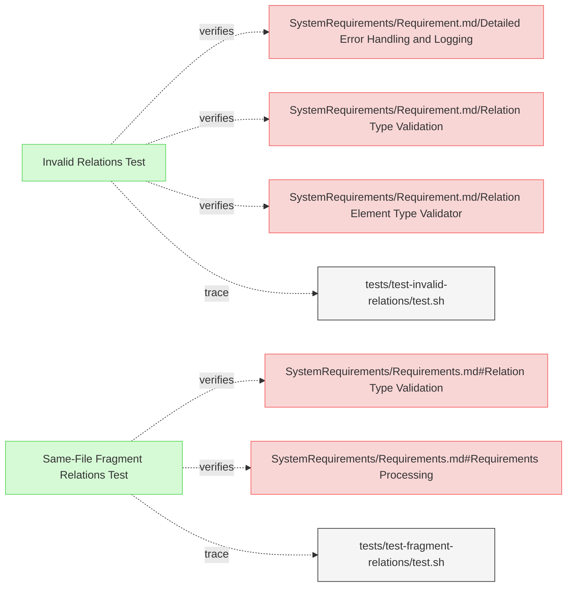

# Validation Tests

This document verifies the requirements for ReqFlow's validation functionality.

## Relation Validation Tests

---

### Invalid Relations Test

The verification test checks that ReqFlow correctly identifies and reports invalid relations of different kinds.

#### Metadata
  * type: verification

#### Details

##### Acceptance Criteria
- System should detect and report invalid relation types (typos, etc.)
- System should detect and report relations to non-existent targets
- System should detect and report if system requirement is missing parent relation
- System should detect and report if there is circular dependency in requirements
- System should detect and report if relation type has incompatible element
- System should detect and report invalid metadata subsection format
- System should detect and report duplicate relations in Relations subsection
- System should detect and report duplicate elements
- System should detect and report duplicate subsections
- System should report clear error messages with details about the invalid format

#### Test Criteria
- Command exits with 0 error code but outputs expected validation errors
- Error output contains specific error messages for each type of invalid relation

#### Test Procedure
1. Create a test fixture in `/tests/fixtures/test-invalid-relations/` with requirements containing invalid relation types
2. Run ReqFlow validation on the test fixture
3. Verify that the validation reports an error for the invalid relation types
4. Verify that error messages contain details about the specific typos found

#### Relations
  * verify: [SystemRequirements/Requirement.md/Detailed Error Handling and Logging](../SystemRequirements/Requirements.md#detailed-error-handling-and-logging)
  * verify: [SystemRequirements/Requirement.md/Relation Type Validation](../SystemRequirements/Requirements.md#relation-type-validation)  
  * verify: [SystemRequirements/Requirement.md/Relation Element Type Validator](../SystemRequirements/Requirements.md#relation-element-type-validator)  
  * trace: [tests/test-invalid-relations/test.sh](../../tests/test-invalid-relations/test.sh)

---

### Same-File Fragment Relations Test

This test verifies that ReqFlow correctly handles and validates relations to fragments within the same file.

#### Metadata
  * type: verification

#### Details

##### Acceptance Criteria
- System should correctly validate relations to fragments within the same file
- System should not report errors for valid fragment references
- System should handle both fragment-only references like "#fragment-id" and proper element IDs

##### Test Criteria
- Command exits with success (zero) return code
- No error output about missing relation targets when using #fragment references
- Successful validation message is displayed

##### Test Procedure
1. Create test fixtures with requirements containing fragment-only references
2. Run ReqFlow validation on the test fixtures
3. Verify that validation succeeds with no errors reported
4. Verify that fragments referenced by proper element ID are correctly validated

#### Relations
  * verify: [SystemRequirements/Requirements.md#Relation Type Validation](../SystemRequirements/Requirements.md#relation-type-validation)
  * verify: [SystemRequirements/Requirements.md#Requirements Processing](../SystemRequirements/Requirements.md#requirements-processing)
  * trace: [tests/test-fragment-relations/test.sh](../../tests/test-fragment-relations/test.sh)

---