# Validation Tests

This document verifies the requirements for ReqFlow's validation functionality.

## Relation Validation Tests

```mermaid
graph LR;
  %% Graph styling
  classDef requirement fill:#f9d6d6,stroke:#f55f5f,stroke-width:1px;
  classDef verification fill:#d6f9d6,stroke:#5fd75f,stroke-width:1px;
  classDef externalLink fill:#d0e0ff,stroke:#3080ff,stroke-width:1px;
  classDef default fill:#f5f5f5,stroke:#333333,stroke-width:1px;

  74e2fafec810fc21["Filesystem Structure Verification"];
  click 74e2fafec810fc21 "ValidationTests.md#filesystem-structure-verification";
  class 74e2fafec810fc21 verification;
  d834cc4bc9dbb07c["UserRequirements.md/Validate Filesystem Structure"];
  class d834cc4bc9dbb07c requirement;
  click d834cc4bc9dbb07c "../UserRequirements.md#validate-filesystem-structure";
  74e2fafec810fc21 -.->|verifies| d834cc4bc9dbb07c;
  a38888f27160e7fa["tests/test-external-folders/test.sh"];
  class a38888f27160e7fa default;
  click a38888f27160e7fa "../../tests/test-external-folders/test.sh";
  74e2fafec810fc21 -.->|trace| a38888f27160e7fa;
  81fcf8160ea0df81["Same-File Fragment Relations Test"];
  click 81fcf8160ea0df81 "ValidationTests.md#same-file-fragment-relations-test";
  class 81fcf8160ea0df81 verification;
  5870488e00ee4f36["SystemRequirements/Requirements.md#Relation Type Validation"];
  class 5870488e00ee4f36 requirement;
  click 5870488e00ee4f36 "../SystemRequirements/Requirements.md#relation-type-validation";
  81fcf8160ea0df81 -.->|verifies| 5870488e00ee4f36;
  99bed90a0d96a1d2["SystemRequirements/Requirements.md#Requirements Processing"];
  class 99bed90a0d96a1d2 requirement;
  click 99bed90a0d96a1d2 "../SystemRequirements/Requirements.md#requirements-processing";
  81fcf8160ea0df81 -.->|verifies| 99bed90a0d96a1d2;
  378d6845d49fb198["tests/test-fragment-relations/test.sh"];
  class 378d6845d49fb198 default;
  click 378d6845d49fb198 "../../tests/test-fragment-relations/test.sh";
  81fcf8160ea0df81 -.->|trace| 378d6845d49fb198;
  fbf9362574b057dd["Invalid Relations Test"];
  click fbf9362574b057dd "ValidationTests.md#invalid-relations-test";
  class fbf9362574b057dd verification;
  bdfd9d65e46117e7["SystemRequirements/Requirement.md/Detailed Error Handling and Logging"];
  class bdfd9d65e46117e7 requirement;
  click bdfd9d65e46117e7 "../SystemRequirements/Requirements.md#detailed-error-handling-and-logging";
  fbf9362574b057dd -.->|verifies| bdfd9d65e46117e7;
  fbf9362574b057dd -.->|verifies| 5870488e00ee4f36;
  212d1317cd2b25fc["SystemRequirements/Requirement.md/Relation Element Type Validator"];
  class 212d1317cd2b25fc requirement;
  click 212d1317cd2b25fc "../SystemRequirements/Requirements.md#relation-element-type-validator";
  fbf9362574b057dd -.->|verifies| 212d1317cd2b25fc;
  c86fd6ece7a8668a["tests/test-invalid-relations/test.sh"];
  class c86fd6ece7a8668a default;
  click c86fd6ece7a8668a "../../tests/test-invalid-relations/test.sh";
  fbf9362574b057dd -.->|trace| c86fd6ece7a8668a;
  20da68187f546235["JSON Output Format Test"];
  click 20da68187f546235 "ValidationTests.md#json-output-format-test";
  class 20da68187f546235 verification;
  5ec6a2668bddf0e["SystemRequirements/Requirements.md#json-output-format"];
  class 5ec6a2668bddf0e requirement;
  click 5ec6a2668bddf0e "../SystemRequirements/Requirements.md#json-output-format";
  20da68187f546235 -.->|verifies| 5ec6a2668bddf0e;
  20da68187f546235 -.->|trace| c86fd6ece7a8668a;
  adacd7f753c51b26["Unstructured Documents Test"];
  click adacd7f753c51b26 "ValidationTests.md#unstructured-documents-test";
  class adacd7f753c51b26 verification;
  5a1719a2649b9922["SystemRequirements/Requirements.md#unstructured-documents"];
  class 5a1719a2649b9922 requirement;
  click 5a1719a2649b9922 "../SystemRequirements/Requirements.md#unstructured-documents";
  adacd7f753c51b26 -.->|verifies| 5a1719a2649b9922;
  eb7d924dd7a53c67["tests/test-valid-relations/test.sh"];
  class eb7d924dd7a53c67 default;
  click eb7d924dd7a53c67 "../../tests/test-valid-relations/test.sh";
  adacd7f753c51b26 -.->|trace| eb7d924dd7a53c67;
  12ba0ce679297f74["Markdown Structure Verification"];
  click 12ba0ce679297f74 "ValidationTests.md#markdown-structure-verification";
  class 12ba0ce679297f74 verification;
  7b1772417b3ad5e["UserRequirements.md/Validate Markdown Structure"];
  class 7b1772417b3ad5e requirement;
  click 7b1772417b3ad5e "../UserRequirements.md#validate-markdown-structure";
  12ba0ce679297f74 -.->|verifies| 7b1772417b3ad5e;
  12ba0ce679297f74 -.->|trace| c86fd6ece7a8668a;
  a137be8592e82aff["Requirements Files Search and Detection Test"];
  click a137be8592e82aff "ValidationTests.md#requirements-files-search-and-detection-test";
  class a137be8592e82aff verification;
  2737f2d770aa0757["SystemRequirements/Requirements.md#requirements-files-search-and-detection"];
  class 2737f2d770aa0757 requirement;
  click 2737f2d770aa0757 "../SystemRequirements/Requirements.md#requirements-files-search-and-detection";
  a137be8592e82aff -.->|verifies| 2737f2d770aa0757;
  79ca606f26bdd145["tests/test-excluded-patterns/test.sh"];
  class 79ca606f26bdd145 default;
  click 79ca606f26bdd145 "../../tests/test-excluded-patterns/test.sh";
  a137be8592e82aff -.->|trace| 79ca606f26bdd145;
  7979634b84bbcfe0["Internal Consistency Verification"];
  click 7979634b84bbcfe0 "ValidationTests.md#internal-consistency-verification";
  class 7979634b84bbcfe0 verification;
  9e524ac696c43a26["UserRequirements.md/Validate Internal Consistency"];
  class 9e524ac696c43a26 requirement;
  click 9e524ac696c43a26 "../UserRequirements.md#validate-internal-consistency";
  7979634b84bbcfe0 -.->|verifies| 9e524ac696c43a26;
  7979634b84bbcfe0 -.->|trace| c86fd6ece7a8668a;
  b89010df01dc2c77["Cross-Component Dependencies Verification"];
  click b89010df01dc2c77 "ValidationTests.md#cross-component-dependencies-verification";
  class b89010df01dc2c77 verification;
  6e40bf9f83a718fa["UserRequirements.md/Validate Cross-Component Dependencies"];
  class 6e40bf9f83a718fa requirement;
  click 6e40bf9f83a718fa "../UserRequirements.md#validate-cross-component-dependencies";
  b89010df01dc2c77 -.->|verifies| 6e40bf9f83a718fa;
  b89010df01dc2c77 -.->|trace| c86fd6ece7a8668a;
  ca085e075bbce0cc["Excluded File Relation Validation Test"];
  click ca085e075bbce0cc "ValidationTests.md#excluded-file-relation-validation-test";
  class ca085e075bbce0cc verification;
  c5c85bedd1cf11e6["SystemRequirements/Requirements.md#excluded-file-relation-validation"];
  class c5c85bedd1cf11e6 requirement;
  click c5c85bedd1cf11e6 "../SystemRequirements/Requirements.md#excluded-file-relation-validation";
  ca085e075bbce0cc -.->|verifies| c5c85bedd1cf11e6;
  ca085e075bbce0cc -.->|trace| 79ca606f26bdd145;
```

---

### Invalid Relations Test

The verification test checks that ReqFlow correctly identifies and reports invalid relations of different kinds.

#### Metadata
  * type: verification

#### Details

##### Acceptance Criteria
- System should detect and report invalid relation types (typos, etc.)
- System should detect and report relations to non-existent targets
- System should detect and report if system requirement is missing parent relation
- System should detect and report if there is circular dependency in requirements
- System should detect and report if relation type has incompatible element
- System should detect and report invalid metadata subsection format
- System should detect and report duplicate relations in Relations subsection
- System should detect and report duplicate elements
- System should detect and report duplicate subsections
- System should report clear error messages with details about the invalid format

#### Test Criteria
- Command exits with 0 error code but outputs expected validation errors
- Error output contains specific error messages for each type of invalid relation

#### Test Procedure
1. Create a test fixture in `/tests/fixtures/test-invalid-relations/` with requirements containing invalid relation types
2. Run ReqFlow validation on the test fixture
3. Verify that the validation reports an error for the invalid relation types
4. Verify that error messages contain details about the specific typos found

#### Relations
  * verify: [SystemRequirements/Requirement.md/Detailed Error Handling and Logging](../SystemRequirements/Requirements.md#detailed-error-handling-and-logging)
  * verify: [SystemRequirements/Requirement.md/Relation Type Validation](../SystemRequirements/Requirements.md#relation-type-validation)  
  * verify: [SystemRequirements/Requirement.md/Relation Element Type Validator](../SystemRequirements/Requirements.md#relation-element-type-validator)  
  * trace: [tests/test-invalid-relations/test.sh](../../tests/test-invalid-relations/test.sh)

---

### Same-File Fragment Relations Test

This test verifies that ReqFlow correctly handles and validates relations to fragments within the same file.

#### Metadata
  * type: verification

#### Details

##### Acceptance Criteria
- System should correctly validate relations to fragments within the same file
- System should not report errors for valid fragment references
- System should handle both fragment-only references like "#fragment-id" and proper element IDs

##### Test Criteria
- Command exits with success (zero) return code
- No error output about missing relation targets when using #fragment references
- Successful validation message is displayed

##### Test Procedure
1. Create test fixtures with requirements containing fragment-only references
2. Run ReqFlow validation on the test fixtures
3. Verify that validation succeeds with no errors reported
4. Verify that fragments referenced by proper element ID are correctly validated

#### Relations
  * verify: [SystemRequirements/Requirements.md#Relation Type Validation](../SystemRequirements/Requirements.md#relation-type-validation)
  * verify: [SystemRequirements/Requirements.md#Requirements Processing](../SystemRequirements/Requirements.md#requirements-processing)
  * trace: [tests/test-fragment-relations/test.sh](../../tests/test-fragment-relations/test.sh)

---

### Markdown Structure Verification

This test verifies that the system validates the Markdown structure of MBSE documentation.

#### Metadata
  * type: verification

#### Details

##### Acceptance Criteria
- System should validate markdown structure against formatting standards
- System should detect deviations from the expected markdown structure
- System should provide clear reporting of structure validation issues

##### Test Criteria
- Command exits with success (0) return code for valid structures
- Command reports issues for invalid structures
- Validation messages include file paths and line numbers for issues

##### Test Procedure
TODO: write test procedure

#### Relations
  * verify: [UserRequirements.md/Validate Markdown Structure](../UserRequirements.md#validate-markdown-structure)
  * trace: [tests/test-invalid-relations/test.sh](../../tests/test-invalid-relations/test.sh)

---

### Filesystem Structure Verification

This test verifies that the system validates the organization of files and folders in the repository.

#### Metadata
  * type: verification

#### Details

##### Acceptance Criteria
- System should validate filesystem structure against expected organization
- System should verify that required folders exist
- System should verify that files are appropriately placed

##### Test Criteria
- Command exits with success (0) return code for valid structures
- Command reports issues for invalid structures
- Validation includes checks for missing required folders

##### Test Procedure
TODO: write test procedure

#### Relations
  * verify: [UserRequirements.md/Validate Filesystem Structure](../UserRequirements.md#validate-filesystem-structure)
  * trace: [tests/test-external-folders/test.sh](../../tests/test-external-folders/test.sh)

---

### Internal Consistency Verification

This test verifies that the system checks the internal consistency of the MBSE model.

#### Metadata
  * type: verification

#### Details

##### Acceptance Criteria
- System should validate internal consistency of the model
- System should detect circular dependencies
- System should identify orphaned elements
- System should detect inconsistent relationship patterns

##### Test Criteria
- Command exits with success (0) return code for consistent models
- Command reports issues for inconsistent models
- Validation includes detailed reporting of inconsistencies

##### Test Procedure
TODO: write test procedure

#### Relations
  * verify: [UserRequirements.md/Validate Internal Consistency](../UserRequirements.md#validate-internal-consistency)
  * trace: [tests/test-invalid-relations/test.sh](../../tests/test-invalid-relations/test.sh)

---

### Cross-Component Dependencies Verification

This test verifies that the system validates dependencies across different components of the MBSE model.

#### Metadata
  * type: verification

#### Details

##### Acceptance Criteria
- System should validate dependencies across different model components
- System should verify proper alignment between architectural layers
- System should validate alignment between requirement levels and verification elements

##### Test Criteria
- Command exits with success (0) return code for valid dependencies
- Command reports issues for invalid dependencies
- Validation includes detailed reporting of dependency mismatches

##### Test Procedure
TODO: write test procedure

#### Relations
  * verify: [UserRequirements.md/Validate Cross-Component Dependencies](../UserRequirements.md#validate-cross-component-dependencies)
  * trace: [tests/test-invalid-relations/test.sh](../../tests/test-invalid-relations/test.sh)

---

### JSON Output Format Test

This test verifies that the system properly implements JSON output formatting for validation and other commands.

#### Metadata
  * type: verification

#### Details

##### Acceptance Criteria
- System shall support --json flag for validation commands
- JSON output shall be properly formatted according to a consistent schema
- JSON structure shall be parsable and machine-readable
- All relevant validation data shall be included in the output

##### Test Criteria
- Commands with --json flag produce valid JSON
- JSON output can be parsed without errors
- Output structure matches expected schema
- All validation errors are properly represented in JSON format

##### Test Procedure
1. Create test fixtures with known validation issues
2. Run ReqFlow with --validate --json flag on the test fixtures
3. Verify that output is valid JSON by parsing it
4. Confirm all validation errors are represented in the JSON output
5. Verify that JSON structure is consistent across different validation scenarios

#### Relations
  * verify: [SystemRequirements/Requirements.md#json-output-format](../SystemRequirements/Requirements.md#json-output-format)
  * trace: [tests/test-invalid-relations/test.sh](../../tests/test-invalid-relations/test.sh)

---

### Requirements Files Search and Detection Test

This test verifies that the system correctly searches for and detects requirements files according to specified patterns and configurations.

#### Metadata
  * type: verification

#### Details

##### Acceptance Criteria
- System shall find all requirements files in project structure based on configuration
- System shall respect excluded file patterns defined in configuration
- System shall handle nested directory structures correctly
- System shall correctly identify and categorize different file types
- System shall process both specifications and external folders

##### Test Criteria
- All expected requirements files are identified
- Files matching exclusion patterns are skipped
- Nested directories are correctly traversed
- Both specifications and external folders are processed
- Non-markdown files are handled appropriately

##### Test Procedure
1. Create test fixtures with various directory structures including:
   - Files in different levels of nesting
   - Files matching exclusion patterns
   - Files in both specifications and external folders
2. Configure ReqFlow with specific pattern rules
3. Run ReqFlow on the test fixtures
4. Verify that all expected files are found and processed
5. Verify that excluded files are correctly skipped
6. Verify correct handling of nested directories

#### Relations
  * verify: [SystemRequirements/Requirements.md#requirements-files-search-and-detection](../SystemRequirements/Requirements.md#requirements-files-search-and-detection)
  * trace: [tests/test-excluded-patterns/test.sh](../../tests/test-excluded-patterns/test.sh)

---

### Unstructured Documents Test

This test verifies that the system correctly handles unstructured documents for relation targets.

#### Metadata
  * type: verification

#### Details

##### Acceptance Criteria
- System shall allow referencing unstructured documents (text files, code files)
- System shall not attempt to parse unstructured documents as requirements
- System shall validate that referenced unstructured documents exist
- System shall not report validation errors for valid references to unstructured documents

##### Test Criteria
- Relations referencing unstructured documents are treated as valid
- No attempt is made to extract elements from unstructured documents
- Validation succeeds when referenced unstructured documents exist
- Validation fails when referenced unstructured documents don't exist

##### Test Procedure
1. Create test fixtures with:
   - Requirements referencing unstructured documents (.txt, .cpp files)
   - Valid references to existing unstructured documents
   - Invalid references to non-existent unstructured documents
2. Run ReqFlow validation on the test fixtures
3. Verify that valid references to unstructured documents are accepted
4. Verify that invalid references to non-existent files are reported
5. Verify that unstructured documents are not parsed for elements

#### Relations
  * verify: [SystemRequirements/Requirements.md#unstructured-documents](../SystemRequirements/Requirements.md#unstructured-documents)
  * trace: [tests/test-valid-relations/test.sh](../../tests/test-valid-relations/test.sh)

---

### Excluded File Relation Validation Test

This test verifies that the system correctly validates relations to excluded files.

#### Metadata
  * type: verification

#### Details

##### Acceptance Criteria
- System shall validate existence of excluded files referenced in relations
- System shall not parse excluded files for elements
- System shall allow relations TO excluded files but not FROM excluded files
- System shall apply exclusion patterns based on configuration

##### Test Criteria
- Relations to excluded files are treated as valid if files exist
- Relations from excluded files are not processed
- Excluded files are not parsed for elements
- Files matching exclusion patterns are correctly identified

##### Test Procedure
1. Create test fixtures with:
   - Files matching exclusion patterns
   - Requirements referencing excluded files
   - Requirements referenced by excluded files (should be ignored)
2. Configure ReqFlow with specific exclusion patterns
3. Run ReqFlow validation on the test fixtures
4. Verify that relations to excluded files are validated for file existence
5. Verify that excluded files are not parsed for elements
6. Verify that relations from excluded files are not processed

#### Relations
  * verify: [SystemRequirements/Requirements.md#excluded-file-relation-validation](../SystemRequirements/Requirements.md#excluded-file-relation-validation)
  * trace: [tests/test-excluded-patterns/test.sh](../../tests/test-excluded-patterns/test.sh)

---

## Validation Report Tests

---

### Validation Report Verification

This test verifies that the system generates detailed validation reports highlighting any inconsistencies or errors.

#### Metadata
  * type: verification

#### Details

##### Acceptance Criteria
- System should generate validation reports of model structure
- Reports should highlight inconsistencies and errors
- Validation details should include clear descriptions of issues

##### Test Criteria
- Command exits with success (0) return code
- Report contains detailed validation information
- Issues are clearly identified with relevant context

##### Test Procedure
TODO: write test procedure

#### Relations
  * verify: [UserRequirements.md/Provide Validation Reports](../UserRequirements.md#provide-validation-reports)
  * trace: [tests/test-invalid-relations/test.sh](../../tests/test-invalid-relations/test.sh)

---

### Verification Gap Analysis Verification

This test verifies that the system produces reports identifying User and Mission requirements that lack verification relationships.

#### Metadata
  * type: verification

#### Details

##### Acceptance Criteria
- System should identify User and Mission requirements without verifiedBy relationships
- System should generate a report of verification gaps
- Report should be formatted to aid in addressing verification gaps

##### Test Criteria
- Command exits with success (0) return code
- Report accurately identifies requirements without verification
- Report includes all required information to address gaps

##### Test Procedure
TODO: write test procedure

#### Relations
  * verify: [UserRequirements.md/Generate Verifications Reports](../UserRequirements.md#generate-verifications-reports)
  * trace: [tests/test-invalid-relations/test.sh](../../tests/test-invalid-relations/test.sh)

---