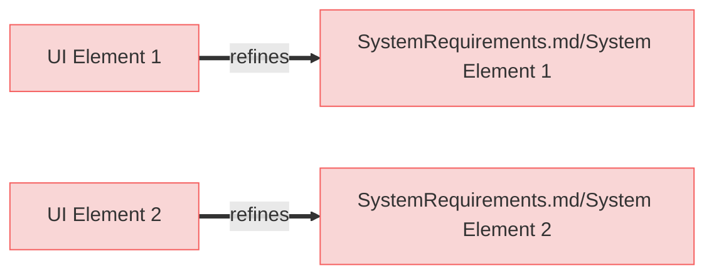
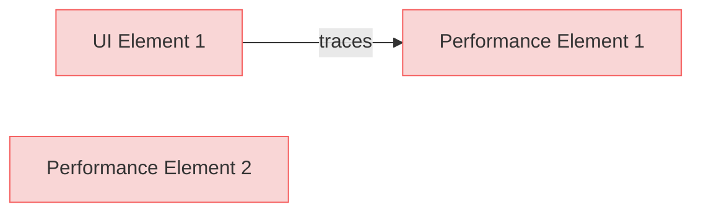

# User Requirements

This is a test user requirements document for diagram generation.

## User Interface Requirements

### UI Element 1

First user interface requirement.

#### Relations
  * refine: [SystemRequirements.md/System Element 1](SystemRequirements.html#system-element-1)

### UI Element 2

Second user interface requirement.

#### Relations
  * refine: [SystemRequirements.md/System Element 2](SystemRequirements.html#system-element-2)

## Performance Requirements

### Performance Element 1

First performance requirement.

#### Relations
  * tracedFrom: [UI Element 1](#ui-element-1)

### Performance Element 2

Second performance requirement with no relations.