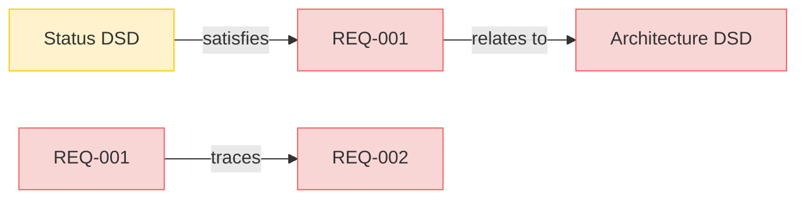

# Requirements

This is a test requirements document for links to files in subfolders without fragments.

## Section 1

### REQ-001

First test requirement referencing a file in a subfolder.

#### Relations
  * satisfiedBy: [Status DSD](DesignSpecifications/Status.md)
  * verifies: [Architecture DSD](DesignSpecifications/Architecture.md)

### REQ-002

Second test requirement with a local reference.

#### Relations
  * tracedFrom: [REQ-001](#req-001)