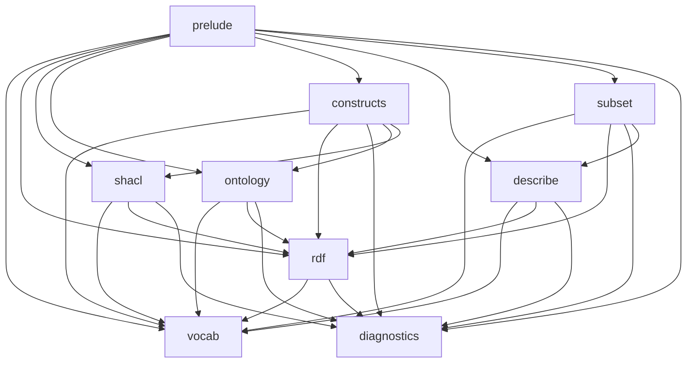
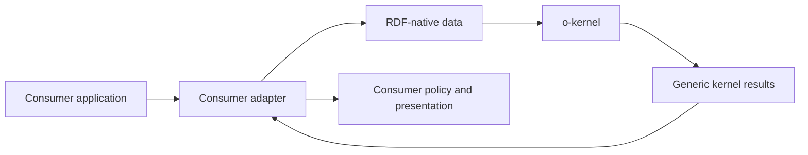

# Elements

### Application Boundary Isolation Specification

Consumer-specific concerns must remain outside `o-kernel`.

#### Details
Out-of-kernel concerns include:

- source-document parsing
- consumer element models and registries
- source maps and source-location diagnostics
- durable runtime graph layer names and visibility policy
- runtime store assembly policy
- default graph mirroring policy
- export visibility rules
- presentation and protocol response DTOs
- on-demand analysis orchestration

When a consuming application uses kernel algorithms to build or validate semantic data, the consuming application must own how inputs are selected, how results are exposed, and how results map back to source documents.

#### Metadata
  * type: specification

#### Relations
  * define: [Application Boundary Isolation](OntologyKernelRequirements.md#application-boundary-isolation)
---

### O-Kernel Physical Module Architecture Specification

The o-kernel crate must use a focused physical module layout for standards-based ontology computation.

#### Details
Module layout:

- `vocab`: RDF, RDFS, OWL, XSD, and SHACL namespace constants, named-node constructors, compile-time bundled standards vocabulary graphs, and reserved vocabulary classification helpers.
- `rdf`: RDF dataset helpers over selected RDF implementation types, including standards-generic parser helpers, serializer helpers, list traversal, and query helpers.
- `shacl`: SHACL shape discovery, target parsing, path parsing, constraint parsing, structural registry construction, and SHACL syntax diagnostics.
- `ontology`: ontology declaration indexing, declared class/property/datatype lookup, named-term lookup, and SHACL-to-ontology alignment inputs.
- `constructs`: direct RDF/RDFS/OWL/SHACL pattern classification into generic construct records, including subclass, membership, domain/range, equivalence, disjointness, inverse property, property chain, restriction, class expression, property characteristic, and shape-overlay records.
- `describe`: bounded RDF term description construction for selected RDF terms, support predicates, annotation predicates, and support-depth policy.
- `subset`: referenced graph subset construction for ontology graphs of interest and dependency RDF graphs.
- `diagnostics`: generic diagnostic types, severities, and codes used by kernel services without application source-location assumptions.
- `prelude`: stable re-exports for commonly used public kernel types and service functions.

Module dependency diagram:



Consumer boundary diagram:



Physical dependency rules:

- Public APIs that carry RDF data must use RDF-native input and output types.
- `vocab` must be dependency-light and usable by every other module.
- `diagnostics` must depend only on standard library dependencies and stable diagnostic value types.
- `rdf` must depend on `vocab` and `diagnostics`.
- `shacl` must depend on `vocab`, `rdf`, and `diagnostics`.
- `ontology` must depend on `vocab`, `rdf`, and `diagnostics`.
- `constructs` must depend on `vocab`, `rdf`, `diagnostics`, `ontology`, and `shacl`.
- `describe` must depend on `vocab`, `rdf`, and `diagnostics`.
- `subset` must depend on `vocab`, `rdf`, `diagnostics`, and `describe`.
- `shacl` and `ontology` must share cross-module data through public types, not through private cross-file coupling.
- `constructs` must use ontology and SHACL public types for ontology declaration and shape-overlay classification.
- `subset` must use description construction public types for direct, support, annotation, and depth-boundary metadata.
- `diagnostics` must stay independent of application source maps, file paths, element identifiers, graph-layer names, and protocol payloads.
- `prelude` must re-export stable public types only; feature internals remain in their owning modules.

File-size and ownership rules:

- A module with multiple independent responsibilities must be split into submodules.
- SHACL implementation must be split into `shacl::target`, `shacl::path`, `shacl::constraint`, `shacl::registry`, and `shacl::align` submodules.
- Construct classification implementation must be split into `constructs::rdf_rdfs`, `constructs::owl_expression`, `constructs::owl_property`, `constructs::restriction`, and `constructs::shacl_overlay` submodules.
- Construct classification orchestration must live in `constructs::classify`.
- Referenced graph subset implementation must be split into `subset::seed`, `subset::reference`, `subset::closure`, and `subset::construct` submodules.
- Public modules must include focused Rust unit tests for their own service behavior.

#### Metadata
  * type: specification

#### Relations
  * define: [O-Kernel Physical Module Architecture](OntologyKernelRequirements.md#o-kernel-physical-module-architecture)
---

### Ontology Construct Classification Specification

The ontology construct classifier must classify direct-authored RDF, RDFS, OWL, and SHACL constructs from RDF quads.

#### Details
Classification behavior:

- `rdfs:domain` and `rdfs:range` become property-domain and property-range constructs.
- `rdfs:subClassOf` becomes subclass-inclusion constructs.
- `rdf:type` assertions for named subjects become membership constructs when the assertion is not solely a declaration of an RDF, RDFS, OWL, or SHACL metamodel construct.
- `owl:disjointWith` becomes disjointness constructs.
- `owl:equivalentClass`, `owl:equivalentProperty`, and `owl:sameAs` become equivalence-group constructs using stable connected components.
- `owl:inverseOf` becomes inverse-property constructs.
- `owl:propertyChainAxiom` RDF lists become ordered property-chain constructs preserving list member order.
- `rdf:type` declarations of OWL property characteristics become property-characteristic constructs for functional, inverse-functional, symmetric, asymmetric, reflexive, irreflexive, and transitive properties.
- `owl:Restriction` with `owl:onProperty`, `owl:allValuesFrom`, `owl:someValuesFrom`, cardinality predicates, `owl:hasValue`, or similar authored restriction predicates becomes restriction constructs.
- `owl:intersectionOf`, `owl:unionOf`, and `owl:complementOf` RDF list or expression structures become class-expression constructs.
- SHACL node shapes and property shapes become shape-overlay constructs over their target classes, paths, datatypes, class constraints, node kinds, cardinality constraints, and allowed-value lists.
- SHACL node-shape target classes plus property-shape paths and facets become normalized slot/facet records reusable by consumers.
- Class-expression projection records must preserve list members in RDF list order and expose usage evidence so consumers can distinguish the expression itself from the property, subclass, or restriction construct that references it.
- Direct-authored classification must not perform OWL reasoning, SHACL-AF rule execution, or inferred materialization.

#### Metadata
  * type: specification

#### Relations
  * define: [Ontology Construct Classification](OntologyKernelRequirements.md#ontology-construct-classification)
---

### Ontology Kernel Public Contract Specification

The o-kernel public contract defines a foundational library boundary for standards-based ontology computation.

#### Details
Contract rules:

- The crate name must be `o-kernel`, with Rust import path `o_kernel`.
- The crate must expose RDF, RDFS, OWL, XSD, SHACL, and SPARQL-compatible ontology services.
- The crate must expose algorithms as reusable services over RDF data.
- The crate must not require consumer-specific source documents, model registries, source maps, diagnostics, graph-layer policies, or presentation DTOs.
- Consumers must depend on the kernel contract when they need standards-based ontology processing.

#### Metadata
  * type: specification

#### Relations
  * define: [Ontology Kernel Public Contract](OntologyKernelRequirements.md#ontology-kernel-public-contract)
---

### Ontology Kernel RDF Native Boundary Specification

The o-kernel crate must use the selected RDF implementation as its low-level data boundary. The initial Rust implementation uses Oxigraph.

#### Details
Implementation rules:

- Public kernel APIs that carry RDF data must accept and return Oxigraph types, including `Quad`, `Triple`, `Term`, `NamedNode`, `NamedOrBlankNode`, `Store`, and `QueryResults`.
- The kernel must not define a replacement RDF graph store.
- The kernel must not define replacement triple, quad, term, or query result models when Oxigraph types are sufficient.
- The kernel must not define a consumer source-block or graph-layer abstraction.
- Thin helper functions around Oxigraph must be limited to parser, serializer, list traversal, or query boilerplate. Helper functions must preserve Oxigraph terms, graph names, error boundaries, and query-result semantics.

#### Metadata
  * type: specification

#### Relations
  * define: [Ontology Kernel RDF Native Boundary](OntologyKernelRequirements.md#ontology-kernel-rdf-native-boundary)
---

### RDF Term Description Construction Specification

The RDF term description construction service must construct a bounded RDF description for selected terms from supplied RDF graph data.

#### Details
Inputs:

- selected RDF terms
- one or more supplied source graphs or an RDF dataset
- support predicates used to follow one-hop supporting resources
- annotation predicates used to copy human-readable descriptions
- support depth policy, defaulting to one hop

Direct description behavior:

- For each selected term, include triples where the selected term is the subject in the supplied source graph data.
- Preserve original RDF terms without rewriting IRIs, blank nodes, literals, datatypes, or language tags.

Support description behavior:

- For each selected term, follow configured support predicates whose object is an IRI or blank node.
- Include triples about the support resource for configured support predicates up to the configured support depth.
- Preserve RDF list structure only when list nodes are reached through configured support predicates and needed to keep the selected construct understandable.

Annotation description behavior:

- For each selected term and included support resource, include triples whose predicate is configured as an annotation predicate.
- Annotation predicates include the caller-supplied annotation predicate set. Standard annotation predicate presets include label, comment, preferred-label, definition, and description properties.

SPARQL-equivalent contracts:

```sparql
CONSTRUCT {
  ?term ?predicate ?object .
}
WHERE {
  VALUES ?term { ...selectedTerms... }
  GRAPH ?sourceGraph {
    ?term ?predicate ?object .
  }
}
```

```sparql
CONSTRUCT {
  ?support ?predicate ?object .
}
WHERE {
  VALUES ?term { ...selectedTerms... }
  VALUES ?supportPredicate { ...supportPredicates... }
  GRAPH ?sourceGraph {
    ?term ?supportPredicate ?support .
    FILTER(isIRI(?support) || isBlank(?support))
    ?support ?predicate ?object .
  }
}
```

```sparql
CONSTRUCT {
  ?describedTerm ?annotationPredicate ?annotationValue .
}
WHERE {
  VALUES ?describedTerm { ...selectedAndSupportTerms... }
  VALUES ?annotationPredicate { ...annotationPredicates... }
  GRAPH ?sourceGraph {
    ?describedTerm ?annotationPredicate ?annotationValue .
  }
}
```

The service must return constructed triples or quads plus enough generic construction metadata for callers to distinguish direct, support, and annotation triples. Consumer-specific source locations, layer assignment, public exposure decisions, and diagnostics remain outside the kernel.

#### Metadata
  * type: specification

#### Relations
  * define: [RDF Term Description Construction](OntologyKernelRequirements.md#rdf-term-description-construction)
---

### Referenced Graph Subset Construction Specification

The referenced graph subset construction service must construct a bounded external ontology dependency subset graph from dependency RDF graphs referenced by ontology graphs of interest.

#### Details
Inputs:

- ontology graphs of interest
- external dependency RDF graphs

The standard external ontology dependency subset API must not require consumers to supply reference predicate sets, support predicate sets, annotation predicate sets, or expansion depth values. Those rules are part of the o-kernel external ontology dependency subset profile.

Standard profile:

- Reference extraction includes RDF subjects, predicates, objects, and RDF list members in ontology graphs of interest.
- Support context includes RDF, RDFS, OWL, and SHACL predicates required to keep selected external classes, properties, datatypes, individuals, restrictions, class expressions, property chains, and shapes understandable.
- Annotation context includes standard label, comment, preferred-label, definition, and description predicates.
- Expansion is bounded by the profile's fixed support-depth rule and reports depth-boundary terms.
- RDF list closure includes selected list heads, list cells, ordered members, and terminal `rdf:nil`.

Reference discovery behavior:

- The service must inspect subjects, predicates, objects, and RDF list members in the ontology graphs of interest.
- The service must select referenced dependency terms whose RDF terms appear in the ontology graphs of interest and also appear as named subjects in the dependency RDF graphs.
- The service must support reference extraction for external classes, properties, datatypes, individuals, annotation properties, SHACL terms, and RDF list members.
- The service must preserve blank-node reachability needed to keep selected dependency constructs structurally complete.

Subset construction behavior:

- The service must include direct description triples for each selected dependency term.
- The service must include support triples reached through the standard profile support context.
- The service must include annotation triples reached through the standard profile annotation context for selected and support terms.
- The service must preserve RDF list closure for selected list heads and selected list cells.
- The service must deduplicate triples without changing RDF terms, graph names, literal datatypes, or language tags.
- The service must terminate at the standard profile expansion bound and report when additional dependency terms were discovered beyond that bound.

Output behavior:

- The service must return the subset graph and generic construction metadata for seed, directly referenced, support, annotation, list-closure, and depth-boundary triples.
- The service must not decide which ontology graphs are in scope for a consuming application.
- The service must not decide whether raw dependency graphs or subset graphs are public.
- The service must not attach application source locations, element identifiers, runtime graph-layer names, or presentation payloads.

SPARQL-equivalent seed discovery contract:

```sparql
CONSTRUCT {
  ?term ?predicate ?object .
}
WHERE {
  {
    GRAPH ?interestGraph {
      ?s ?p ?candidate .
      FILTER(isIRI(?candidate) || isBlank(?candidate))
    }
    BIND(?candidate AS ?term)
  }
  UNION
  {
    GRAPH ?interestGraph {
      ?candidate ?p ?o .
      FILTER(isIRI(?candidate) || isBlank(?candidate))
    }
    BIND(?candidate AS ?term)
  }
  UNION
  {
    GRAPH ?interestGraph {
      ?s ?candidate ?o .
      FILTER(isIRI(?candidate))
    }
    BIND(?candidate AS ?term)
  }
  GRAPH ?dependencyGraph {
    ?term ?predicate ?object .
  }
}
```

The Rust implementation must express this contract as RDF-native graph operations, SPARQL queries, or a combination that preserves the same observable subset semantics.

#### Metadata
  * type: specification

#### Relations
  * define: [Referenced Graph Subset Construction](OntologyKernelRequirements.md#referenced-graph-subset-construction)
---

### SHACL Ontology Alignment Specification

The SHACL ontology aligner must align a compiled SHACL registry with a supplied domain ontology index.

#### Details
The generic SHACL ontology aligner must:

- Accept a compiled SHACL registry and a domain ontology index as input.
- Provide a domain-index constructor from supplied RDF quads so callers can pass an ontology context without hand-populating class/property/datatype buckets.
- Avoid dependencies on consumer element types, graph registry internals, source identifiers, and consumer validation wording.
- Cross-reference SHACL target classes against declared ontology classes.
- Cross-reference named `sh:targetNode` references against resolvable named nodes from the supplied ontology index.
- Cross-reference `sh:targetSubjectsOf`, `sh:targetObjectsOf`, parsed property paths, inverse paths, and relational property constraints against declared ontology properties.
- Cross-reference `sh:class` constraints against declared ontology classes.
- Cross-reference `sh:datatype` constraints against declared ontology datatypes or accepted built-in datatype vocabulary.
- Preserve `sh:hasValue` and `sh:in` values as parsed constraint facts without treating every listed IRI as an ontology term-existence requirement.
- Return generic alignment errors such as undeclared class, undeclared property, undeclared datatype, undeclared target node, and invalid inverse path, preserving the SHACL predicate that caused the reference.
- Keep full SHACL data validation/execution out of scope unless a separate validation engine is introduced.

#### Metadata
  * type: specification

#### Relations
  * define: [SHACL Ontology Alignment](OntologyKernelRequirements.md#shacl-ontology-alignment)
---

### SHACL Structural Parser Registry Specification

The SHACL structural parser registry must compile SHACL RDF graphs into reusable typed structures.

#### Details
The SHACL parser registry must:

- Accept RDF terms and quads as input.
- Avoid dependencies on consumer element types, source documents, graph registries, source identifiers, and consumer validation wording.
- Discover shape node candidates from explicit shape indicators (`sh:NodeShape`, `sh:PropertyShape`, `sh:Shape`), target predicates (`sh:targetClass`, `sh:targetNode`, `sh:targetSubjectsOf`, `sh:targetObjectsOf`, `sh:target`), property shape references, and `sh:path`.
- Deduplicate shape node candidates before structural parsing.
- Classify each shape as a node shape or property shape based on SHACL type and path structure.
- Extract target identifiers as typed SHACL target variants.
- Deconstruct property paths into recursive AST path nodes for IRI paths, inverse paths, sequence paths, alternative paths, and repetition modifiers while preserving RDF term values directly.
- Preserve nested property-shape parent-child relationships.
- Map supported constraint syntax into typed AST constraints for datatype, class, node kind, cardinality, value range, string, language, relational property, logical, qualified value, enumeration, constant, and SPARQL constraints.
- Preserve raw SHACL constraint facts as predicate/object pairs alongside typed constraints.
- Return parser diagnostics for malformed SHACL structures without converting those diagnostics into consumer-specific errors.
- Store compiled shapes in a reusable registry keyed by RDF shape identifiers.

#### Metadata
  * type: specification

#### Relations
  * define: [SHACL Structural Parser Registry](OntologyKernelRequirements.md#shacl-structural-parser-registry)
---

### SHACL and Ontology Algorithm Services Specification

The o-kernel crate must provide standards-based SHACL and ontology algorithms.

#### Details
Service rules:

- Provide RDF/RDFS/OWL/XSD/SHACL vocabulary constants.
- Recognize standards-reserved RDF/RDFS/OWL/XSD vocabulary.
- Parse SHACL node shapes and property shapes from RDF quads.
- Parse SHACL targets, property paths, and syntax constraints from RDF quads.
- Report generic SHACL syntax sanity diagnostics without source-document assumptions.
- Provide generic ontology construct classification over RDF quads for OWL/RDFS constructs such as subclass inclusion, membership, domain/range, restrictions, class expressions, inverse properties, equivalence, disjointness, property chains, and shape overlays.
- Keep source provenance, layer placement, and consumer-specific diagnostic mapping outside the kernel.

#### Metadata
  * type: specification

#### Relations
  * define: [SHACL and Ontology Algorithm Services](OntologyKernelRequirements.md#shacl-and-ontology-algorithm-services)
---

### Standards Reserved Vocabulary Recognition Specification

The standards reserved vocabulary registry must derive RDF, RDFS, OWL, and SHACL reserved IRIs from bundled standards vocabulary graphs and define valid semantic positions for those terms.

#### Details
Standard prefix namespace bindings:

- `rdf`: `http://www.w3.org/1999/02/22-rdf-syntax-ns#`
- `rdfs`: `http://www.w3.org/2000/01/rdf-schema#`
- `xsd`: `http://www.w3.org/2001/XMLSchema#`
- `owl`: `http://www.w3.org/2002/07/owl#`
- `sh`: `http://www.w3.org/ns/shacl#`

Reserved vocabulary validation must be based over expanded IRIs. Prefix-name matching must not be used: aliases such as `xsd:string` and `xs:string` are equivalent only when they expand to the same full IRI. Namespace-prefix matching is limited to early namespace classification. Namespace-prefix matching must not prove that an arbitrary IRI under a standard namespace is valid.

The o-kernel crate must bundle standards vocabulary graphs for RDF, RDFS, OWL, and SHACL as compile-time assets and parse them into a reusable reserved vocabulary index. XSD datatypes and facets remain explicit kernel datatype policy because XML Schema datatypes do not rely on a project ontology source file.

Bundled standards vocabulary assets are pinned as follows:

| Vocabulary | Source URL | Local asset | Pinned version/date |
|------------|------------|-------------|---------------------|
| RDF | `https://www.w3.org/1999/02/22-rdf-syntax-ns` | `crates/o-kernel/src/vocab/standards/rdf.ttl` | `dc:date "2019-12-16"` |
| RDFS | `https://www.w3.org/2000/01/rdf-schema` | `crates/o-kernel/src/vocab/standards/rdfs.ttl` | No explicit version/date in the downloaded vocabulary graph; pin by source URL and committed file content. |
| OWL | `https://www.w3.org/2002/07/owl` | `crates/o-kernel/src/vocab/standards/owl.ttl` | `owl:versionInfo "$Date: 2009/11/15 10:54:12 $"`, `owl:versionIRI <http://www.w3.org/2002/07/owl>` |
| SHACL | `https://www.w3.org/ns/shacl` | `crates/o-kernel/src/vocab/standards/shacl.ttl` | Header comment: `Version from 2017-07-20` |

Updating one of these assets is a standards-vocabulary change and must update this table, the bundled file, and the reserved vocabulary unit tests in the same change.

The registry must classify reserved IRIs by semantic position, including:

- built-in datatypes
- datatype facets
- annotation vocabulary
- reserved classes
- reserved object properties
- reserved data properties
- SHACL syntax vocabulary

Built-in datatype positions include:

- `rdfs:range` values of datatype properties when the object is a datatype IRI
- SHACL `sh:datatype` values
- datatype classification in ontology construct classification

The built-in datatype subset must include:

- `rdf:PlainLiteral`
- `rdf:XMLLiteral`
- `rdfs:Literal`
- `owl:real`
- `owl:rational`
- standard XML Schema datatype IRIs with OWL special treatment: `xsd:anyURI`, `xsd:base64Binary`, `xsd:boolean`, `xsd:byte`, `xsd:dateTime`, `xsd:dateTimeStamp`, `xsd:decimal`, `xsd:double`, `xsd:float`, `xsd:hexBinary`, `xsd:int`, `xsd:integer`, `xsd:language`, `xsd:long`, `xsd:Name`, `xsd:NCName`, `xsd:negativeInteger`, `xsd:NMTOKEN`, `xsd:nonNegativeInteger`, `xsd:nonPositiveInteger`, `xsd:normalizedString`, `xsd:positiveInteger`, `xsd:short`, `xsd:string`, `xsd:token`, `xsd:unsignedByte`, `xsd:unsignedInt`, `xsd:unsignedLong`, and `xsd:unsignedShort`

The supported SHACL datatype-position subset must additionally include XML Schema datatypes commonly used by closed-world data validation but not classified as OWL built-in datatypes: `xsd:date`, `xsd:time`, `xsd:duration`, `xsd:dayTimeDuration`, `xsd:yearMonthDuration`, `xsd:gDay`, `xsd:gMonth`, `xsd:gMonthDay`, `xsd:gYear`, and `xsd:gYearMonth`.

The datatype facet subset must include supported XSD facet IRIs such as `xsd:length`, `xsd:minLength`, `xsd:maxLength`, `xsd:pattern`, `xsd:minInclusive`, `xsd:maxInclusive`, `xsd:minExclusive`, and `xsd:maxExclusive`. Facet IRIs are valid only in facet/constraint positions, not as datatypes.

The registry must not treat arbitrary custom IRIs as reserved vocabulary simply because RDF parsing succeeds or because an IRI starts with a standard namespace.

#### Metadata
  * type: specification

#### Relations
  * define: [Standards Reserved Vocabulary Recognition](OntologyKernelRequirements.md#standards-reserved-vocabulary-recognition)
---
