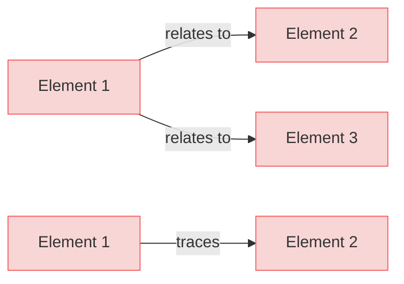
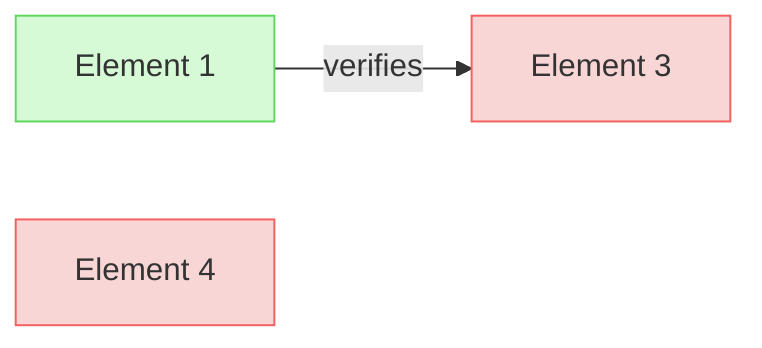

# Test Requirements

This is a requirements document specifically created for testing diagram generation.

## Section 1

### Element 1

This is a test element with relations.

#### Relations
  * satisfies: [Element 2](#element-2)
  * verifies: [Element 3](#element-3)

### Element 2

This is another test element with relations.

#### Relations
  * tracedFrom: [Element 1](#element-1)

## Section 2

### Element 3

This is a third test element.

#### Relations
  * verifiedBy: [Element 1](#element-1)

### Element 4

This is a fourth test element with no relations.
