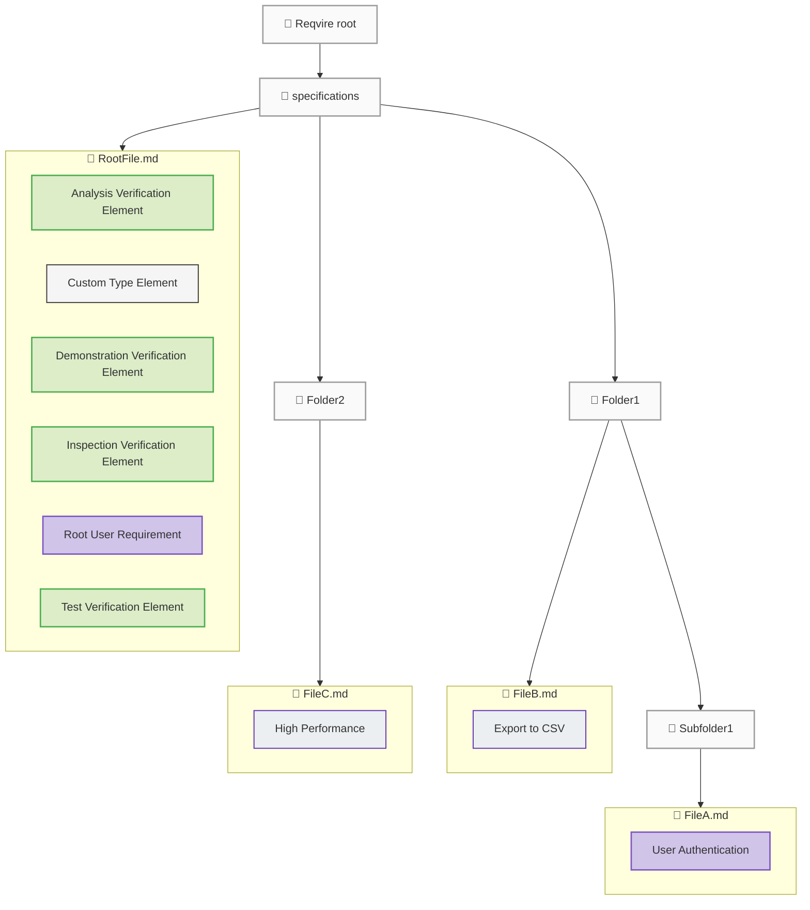

*Elements filtered to show only root elements (those without hierarchical parent relations within the same file).*

```mermaid
graph TD
  %% Graph styling
  classDef userRequirement fill:#D1C4E9,stroke:#7E57C2,stroke-width:2px;
  classDef systemRequirement fill:#E1D8EE,stroke:#673AB7,stroke-width:1.5px;
  classDef requirement fill:#ECEFF1,stroke:#673AB7,stroke-width:1.5px;
  classDef verification fill:#DCEDC8,stroke:#4CAF50,stroke-width:2px;
  classDef default fill:#F5F5F5,stroke:#424242,stroke-width:1.5px;
  classDef folder fill:#FAFAFA,stroke:#9E9E9E,stroke-width:2px;
  classDef file fill:#FFF8E1,stroke:#FFCA28,stroke-width:2px;

  root["📁 Reqvire root"]
  class root folder

  specifications["📁 specifications"]
  root --> specifications
  class specifications folder
  specifications_Folder1["📁 Folder1"]
  specifications --> specifications_Folder1
  class specifications_Folder1 folder
  specifications_Folder1_Subfolder1["📁 Subfolder1"]
  specifications_Folder1 --> specifications_Folder1_Subfolder1
  class specifications_Folder1_Subfolder1 folder
  subgraph specifications/Folder1/Subfolder1/FileA["📄 FileA.md"]
    58d1cd147301f9e3["User Authentication"]
  end
  specifications_Folder1_Subfolder1 --> specifications/Folder1/Subfolder1/FileA
  subgraph specifications/Folder1/FileB["📄 FileB.md"]
    e08a9833904afb54["Export to CSV"]
  end
  specifications_Folder1 --> specifications/Folder1/FileB
  specifications_Folder2["📁 Folder2"]
  specifications --> specifications_Folder2
  class specifications_Folder2 folder
  subgraph specifications/Folder2/FileC["📄 FileC.md"]
    25af44158bf43fcc["High Performance"]
  end
  specifications_Folder2 --> specifications/Folder2/FileC
  subgraph specifications/RootFile["📄 RootFile.md"]
    8be34e37b1135168["Analysis Verification Element"]
    17cdb2bd8b866540["Custom Type Element"]
    27ce8e2d3add00a7["Demonstration Verification Element"]
    e65293d51dd83e69["Inspection Verification Element"]
    2a302bfb04c46059["Root User Requirement"]
    939fef5f29ad393f["Test Verification Element"]
  end
  specifications --> specifications/RootFile

  %% Element type styling
  class e08a9833904afb54 requirement
  class f0838bb4b888bb69 requirement
  class 490e1613c01f9f25 requirement
  class b9b9c21ca4e8fef6 requirement
  class 58d1cd147301f9e3 userRequirement
  class 25af44158bf43fcc requirement
  class 06d646615c67db9c requirement
  class 8be34e37b1135168 verification
  class 17cdb2bd8b866540 default
  class 27ce8e2d3add00a7 verification
  class e65293d51dd83e69 verification
  class e7f7eefa12a25e33 requirement
  class 2a302bfb04c46059 userRequirement
  class 939fef5f29ad393f verification

  %% Clickable links
  click e08a9833904afb54 "specifications/Folder1/FileB.md#export-to-csv"
  click f0838bb4b888bb69 "specifications/Folder1/FileB.md#import-from-json"
  click 490e1613c01f9f25 "specifications/Folder1/Subfolder1/FileA.md#data-validation"
  click b9b9c21ca4e8fef6 "specifications/Folder1/Subfolder1/FileA.md#error-logging"
  click 58d1cd147301f9e3 "specifications/Folder1/Subfolder1/FileA.md#user-authentication"
  click 25af44158bf43fcc "specifications/Folder2/FileC.md#high-performance"
  click 06d646615c67db9c "specifications/Folder2/FileC.md#scalability"
  click 8be34e37b1135168 "specifications/RootFile.md#analysis-verification-element"
  click 17cdb2bd8b866540 "specifications/RootFile.md#custom-type-element"
  click 27ce8e2d3add00a7 "specifications/RootFile.md#demonstration-verification-element"
  click e65293d51dd83e69 "specifications/RootFile.md#inspection-verification-element"
  click e7f7eefa12a25e33 "specifications/RootFile.md#root-system-requirement"
  click 2a302bfb04c46059 "specifications/RootFile.md#root-user-requirement"
  click 939fef5f29ad393f "specifications/RootFile.md#test-verification-element"
```

