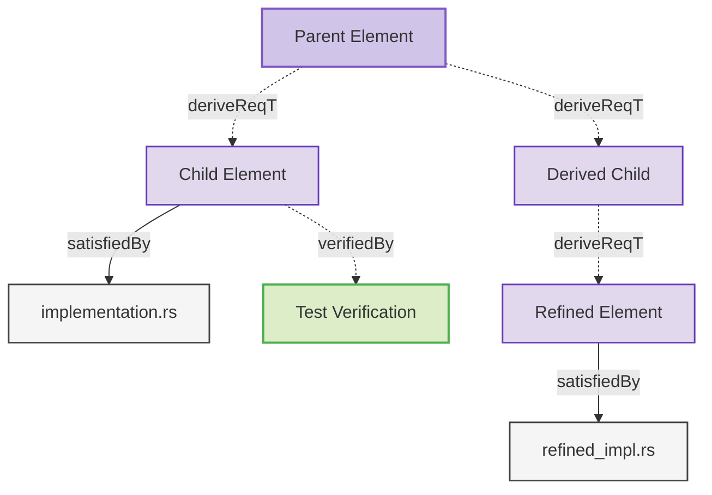

# Elements

This document contains test data specifically designed to verify diagram relation filtering behavior.

### Parent Element

This is a parent element that should be included in child section diagrams.

#### Metadata
  * type: user-requirement

#### Relations
  * derive: [Child Element](#child-element)
  * derive: [Derived Child](#derived-child)
---

### Child Element

This element has a parent in a different section to test hierarchy inclusion.

#### Relations
  * derivedFrom: [Parent Element](#parent-element)
  * satisfiedBy: [implementation.rs](implementation.rs)
  * verifiedBy: [Test Verification](#test-verification)
---

### Derived Child

This element is derived from the parent to test derivation relationships.

#### Relations
  * derivedFrom: [Parent Element](#parent-element)
  * derive: [Refined Element](#refined-element)
---

### Test Verification

This verification element tests the child element.

#### Metadata
  * type: verification

#### Relations
  * verify: [Child Element](#child-element)
---

### Refined Element

This element is further derived from the derived child with more details.

#### Relations
  * derivedFrom: [Derived Child](#derived-child)
  * satisfiedBy: [refined_impl.rs](refined_impl.rs)
---