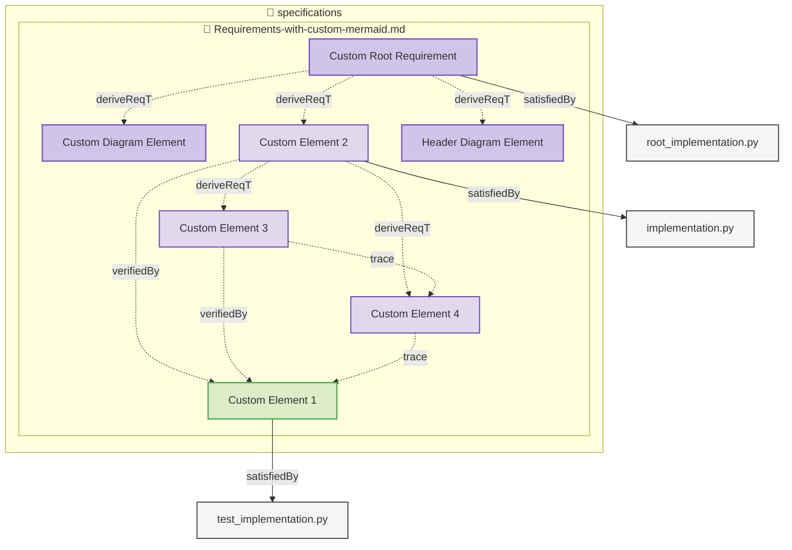
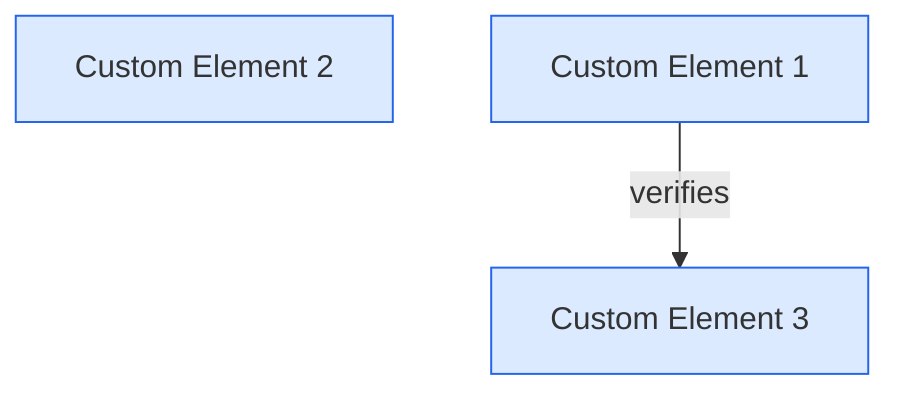
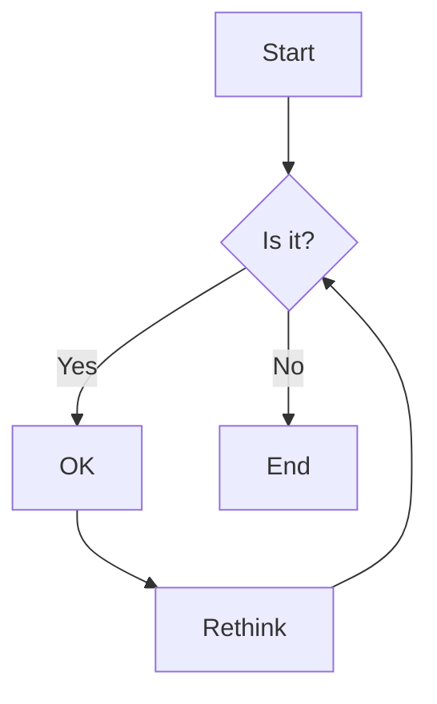
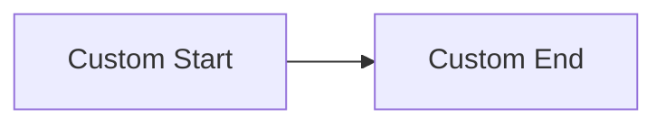
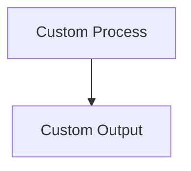

# Elements

This is a requirements document specifically created for testing diagram generation.

### Custom Root Requirement

This is the root requirement for testing purposes.

#### Metadata
  * type: user-requirement

#### Relations
  * satisfiedBy: [root_implementation.py](root_implementation.py)
---

### Custom Element 1

This is a test verification element with relations.

#### Metadata
  * type: verification

#### Relations
  * satisfiedBy: [test_implementation.py](test_implementation.py)
  * verify: [Custom Element 3](#custom-element-3)
---

### Custom Element 2

This is another test element with relations.

#### Relations
  * derivedFrom: [Custom Root Requirement](#custom-root-requirement)
  * verifiedBy: [Custom Element 1](#custom-element-1)
  * satisfiedBy: [implementation.py](implementation.py)
  * derive: [Custom Element 3](#custom-element-3)
  * derive: [Custom Element 4](#custom-element-4)
---

This paragraph contains a custom mermaid diagram - should not be removed:

This section contains BOTH a custom mermaid diagram AND elements - custom diagram should be preserved:

### Custom Diagram Element

This element is in a section with a custom diagram.

#### Metadata
  * type: user-requirement

#### Relations
  * derivedFrom: [Custom Root Requirement](#custom-root-requirement)
---

This section has custom diagram immediately after header - it should be preserved.

### Header Diagram Element

This element is in a section with custom diagram right after header.

#### Metadata
  * type: user-requirement

#### Relations
  * derivedFrom: [Custom Root Requirement](#custom-root-requirement)
---

### Custom Element 3

This is a third test element.

#### Relations
  * derivedFrom: [Custom Element 2](#custom-element-2)
  * verifiedBy: [Custom Element 1](#custom-element-1)
  * trace: [Custom Element 4](#custom-element-4)
---

### Custom Element 4

This is a fourth test element with relations.

#### Relations
  * derivedFrom: [Custom Element 2](#custom-element-2)
  * trace: [Custom Element 1](#custom-element-1)
---