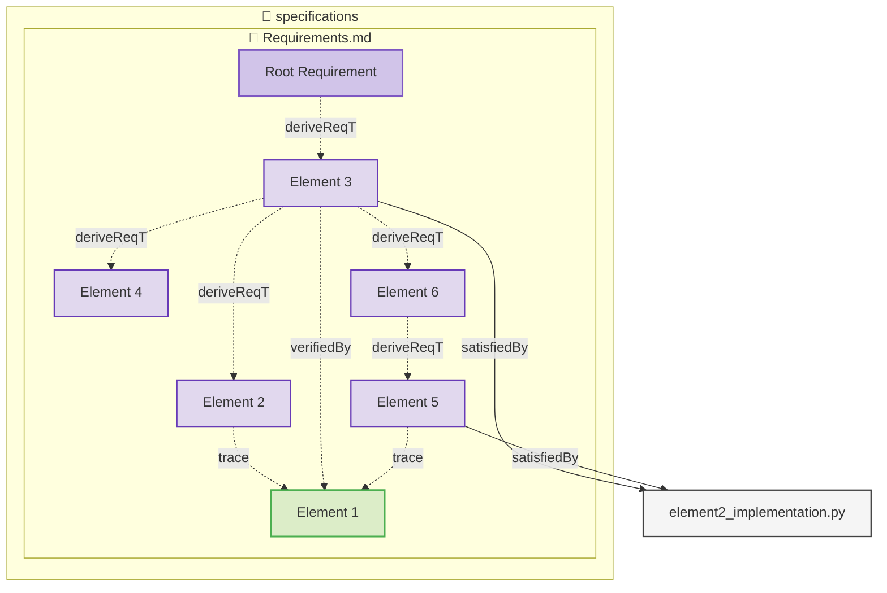

# Elements

This is a requirements document specifically created for testing diagram generation.

### Root Requirement

This is a root requirement for testing purposes.

#### Metadata
  * type: user-requirement

#### Relations
  * derive: [Element 3](#element-3)

### Element 1

This is a test verification element with relations.

#### Metadata
  * type: test-verification

#### Relations
  * verify: [Element 3](#element-3)

### Element 2

This is another test element (requirement) with relations.

#### Metadata
  * type: requirement

#### Relations
  * derivedFrom: [Element 3](#element-3)
  * trace: [Element 1](#element-1)

### Element 3

This is a third test element.

#### Metadata
  * type: requirement

#### Relations
  * derivedFrom: [Root Requirement](#root-requirement)
  * verifiedBy: [Element 1](#element-1)
  * satisfiedBy: [element2_implementation.py](element2_implementation.py)

### Element 4

This is a fourth test element with relations.

#### Metadata
  * type: requirement

#### Relations
  * derivedFrom: [Element 3](#element-3)

### Element 5

This is a fifth test element.

#### Metadata
  * type: requirement

#### Relations
  * derivedFrom: [Element 6](#element-6)
  * trace: [Element 1](#element-1)
  * satisfiedBy: [element2_implementation.py](element2_implementation.py)

### Element 6

This is a sixth test element.

#### Metadata
  * type: requirement

#### Relations
  * derive: [Element 5](#element-5)
  * derivedFrom: [Element 3](#element-3)

