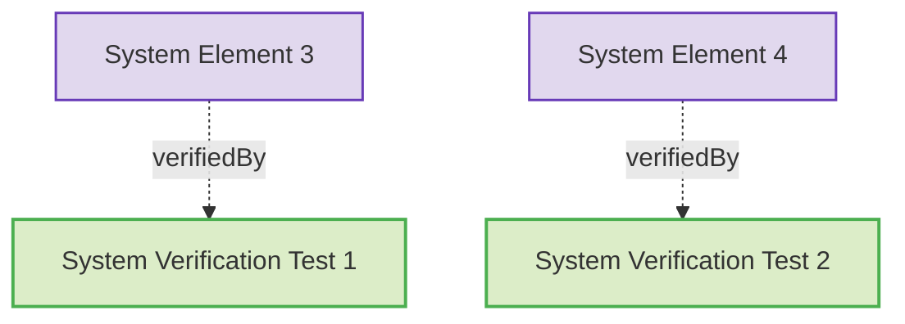
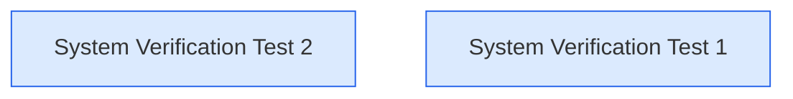

# Elements

This document contains verification tests for the system requirements.

### System Verification Test 1

First system verification test.

#### Metadata
  * type: verification

#### Relations
  * verify: [SystemRequirements.md#system-element-3](SystemRequirements.md#system-element-3)
---

### System Verification Test 2

Second system verification test.

#### Metadata
  * type: verification

#### Relations
  * verify: [SystemRequirements.md#system-element-4](SystemRequirements.md#system-element-4)
---