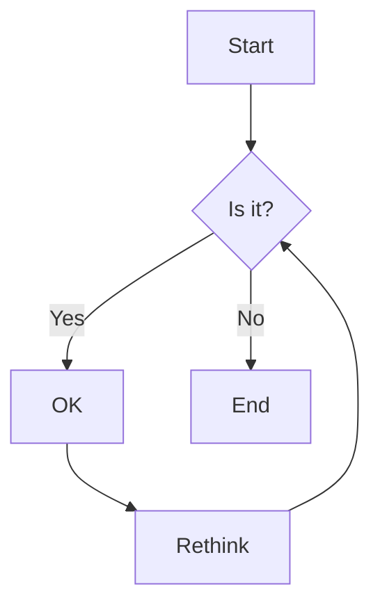
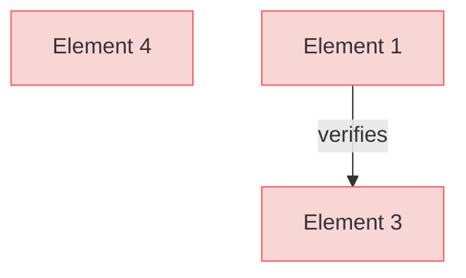

# Test Requirements with Custom Mermaid

This is a requirements document specifically created for testing diagram generation.

## Root Requirements

### Root Requirement

This is the root requirement for testing purposes.

#### Metadata
  * type: user-requirement

#### Relations
  * satisfiedBy: [root_implementation.py](root_implementation.py)

## Section 1

### Element 1

This is a test verification element with relations.

#### Metadata
  * type: verification

#### Relations
  * satisfiedBy: [test_implementation.py](test_implementation.py)
  * verify: [Element 3](#element-3)

### Element 2

This is another test element with relations.

#### Relations
  * derivedFrom: [Root Requirement](#root-requirement)
  * verifiedBy: [Element 1](#element-1)
  * satisfiedBy: [implementation.py](implementation.py)
  * derive: [Element 3](#element-3)
  * derive: [Element 4](#element-4)

## Custom Mermaid Diagram Section

This section contains a custom mermaid diagram that should not be removed:

## Section 2

### Element 3

This is a third test element.

#### Relations
  * derivedFrom: [Element 2](#element-2)
  * verifiedBy: [Element 1](#element-1)
  * trace: [Element 4](#element-4)

### Element 4

This is a fourth test element with relations.

#### Relations
  * derivedFrom: [Element 2](#element-2)
  * trace: [Element 1](#element-1)