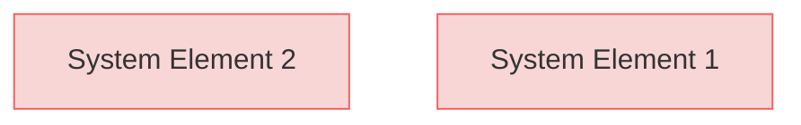
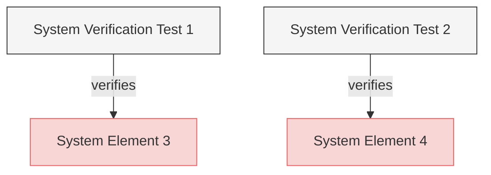

# System Requirements

This is a test system requirements document for diagram generation.

## Functional Requirements

### System Element 1

First system requirement.

#### Relations
  * derivedFrom: [UserRequirements.md#ui-element-1](UserRequirements.md#ui-element-1)

### System Element 2

Second system requirement.

#### Relations
  * derivedFrom: [UserRequirements.md#ui-element-2](UserRequirements.md#ui-element-2)

## Security Requirements

### System Element 3

System security requirement.

#### Relations
  * derivedFrom: [System Element 1](#system-element-1)
  * verifiedBy: [VerificationTests.md#system-verification-test-1](VerificationTests.md#system-verification-test-1)

### System Element 4

Another system security requirement.

#### Relations
  * derivedFrom: [System Element 2](#system-element-2)
  * verifiedBy: [VerificationTests.md#system-verification-test-2](VerificationTests.md#system-verification-test-2)