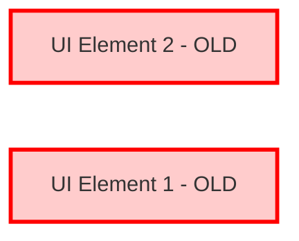
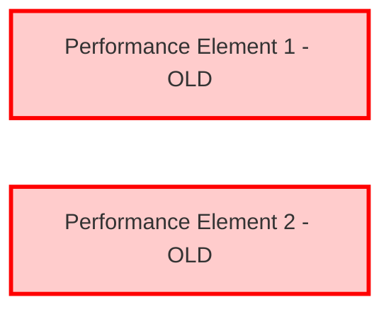

# User Requirements

This is a test user requirements document for diagram generation.

## User Interface Requirements

### Main User Interface Requirement

This is the main user interface requirement that defines overall UI behavior.

#### Metadata
  * type: user-requirement

### UI Element 1

First user interface requirement.

#### Relations
  * derivedFrom: [Main User Interface Requirement](#main-user-interface-requirement)
  * derive: [SystemRequirements.md#system-element-1](SystemRequirements.md#system-element-1)

### UI Element 2

Second user interface requirement.

#### Relations
  * derivedFrom: [Main User Interface Requirement](#main-user-interface-requirement)
  * derive: [SystemRequirements.md#system-element-2](SystemRequirements.md#system-element-2)

## Performance Requirements

### Performance Element 1

First performance requirement.

#### Relations
  * derivedFrom: [UI Element 1](#ui-element-1)

### Performance Element 2

Second performance requirement.

#### Relations
  * derivedFrom: [UI Element 2](#ui-element-2)