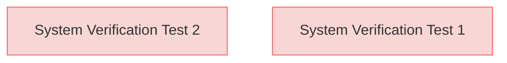

# Verification Tests

This document contains verification tests for the system requirements.

## System Verification Tests

### System Verification Test 1

First system verification test.

#### Relations
* verify: [SystemRequirements.md/System Element 3](SystemRequirements.html#system-element-3)

### System Verification Test 2

Second system verification test.

#### Relations
* verify: [SystemRequirements.md/System Element 4](SystemRequirements.html#system-element-4)