# Mixed Link Types Test

This document tests both direct path and GitHub URL style links in mermaid diagrams.

## Mixed Link Types

```mermaid
graph LR;
  %% Graph styling
  classDef requirement fill:#f9d6d6,stroke:#f55f5f,stroke-width:1px;
  classDef verification fill:#d6f9d6,stroke:#5fd75f,stroke-width:1px;
  classDef externalLink fill:#d0e0ff,stroke:#3080ff,stroke-width:1px;
  classDef default fill:#f5f5f5,stroke:#333333,stroke-width:1px;

  req1["Direct Path Link"];
  click req1 "TestRequirements.md#test-requirement-1";
  class req1 requirement;
  
  req2["GitHub URL Link"];
  click req2 "https://github.com/user/repo/blob/main/specifications/TestRequirements.md#test-requirement-1";
  class req2 requirement;
  
  req3["Non-MD Link"];
  click req3 "https://github.com/user/repo/blob/main/src/main.rs";
  class req3 requirement;
  
  req4["Path with Parent Directories"];
  click req4 "../TestRequirements.md#test-requirement-2";
  class req4 requirement;
  
  req5["MD File Without Fragment"];
  click req5 "TestRequirements.md";
  class req5 requirement;
  
  req6["GitHub URL Without Fragment"];
  click req6 "https://github.com/user/repo/blob/main/specifications/TestRequirements.md";
  class req6 requirement;
  
  req1 -.->|trace| req2;
  req2 -.->|trace| req3;
  req3 -.->|trace| req4;
  req4 -.->|trace| req5;
  req5 -.->|trace| req6;
```

### Direct Path Link Test

This test verifies direct path links in mermaid diagrams.

#### Metadata
  * type: user-requirement

#### Relations
  * trace: [TestRequirements.md#test-requirement-1](../TestRequirements.md#test-requirement-1)

---

### GitHub URL Link Test

This test verifies GitHub URL style links in mermaid diagrams.

#### Metadata
  * type: user-requirement

#### Relations
  * trace: [GitHub Link](https://github.com/user/repo/blob/main/specifications/TestRequirements.md#test-requirement-1)

---
