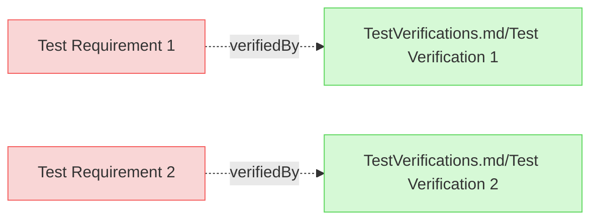

# Test Requirements

This document contains test requirements for HTML export testing.

## Requirements

### Test Requirement 1

This is a test requirement with links to [README.md](README.md) and [TestVerifications.md](TestVerifications.md).

#### Relations
  * verifiedBy: [TestVerifications.md/Test Verification 1](TestVerifications.md#test-verification-1)

---

### Test Requirement 2

This is another test requirement.

#### Relations
  * verifiedBy: [TestVerifications.md/Test Verification 2](TestVerifications.md#test-verification-2)

---