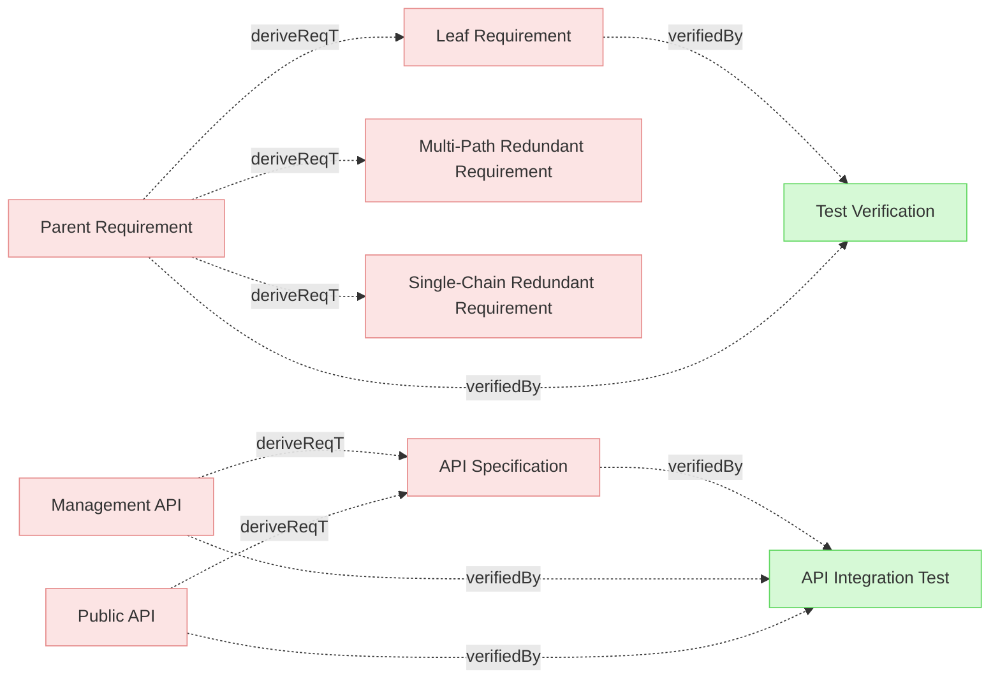

# Test Verifications

## Verifications

### Test Verification

This verification has redundant verify relations - it verifies both the leaf requirement and its parent.

#### Metadata
  * type: test-verification

#### Relations
  * verify: [Leaf Requirement](../Requirements.md#leaf-requirement)
  * verify: [Parent Requirement](../Requirements.md#parent-requirement)
---

### API Integration Test

This test verifies the complete API implementation including Public API, Management API, and API Specification.

This is a test case for branching redundancy detection: the direct link to "Authorization" should be detected as redundant since there are indirect paths through both "Public API" and "Management API" (and also through "API Specification").

Expected redundant relation: specifications/SystemRequirements.md#authorization (reachable from 3 paths)

#### Metadata
  * type: test-verification

#### Relations
  * verify: [Public API](../SystemRequirements.md#public-api)
  * verify: [Management API](../SystemRequirements.md#management-api)
  * verify: [API Specification](../SystemRequirements.md#api-specification)
---