**Total Elements**: 1
**Total Relations**: 12

## [Model Structure Exploration](specifications/UserRequirements.md#model-structure-exploration)

**Type**: user-requirement
**File**: [specifications/UserRequirements.md](specifications/UserRequirements.md)

```mermaid
graph LR
  classDef userRequirement fill:#D1C4E9,stroke:#7E57C2,stroke-width:2px;
  classDef systemRequirement fill:#E1D8EE,stroke:#673AB7,stroke-width:1.5px;
  classDef verification fill:#DCEDC8,stroke:#4CAF50,stroke-width:2px;
  classDef default fill:#F5F5F5,stroke:#424242,stroke-width:1.5px;

  classDef folder fill:#FAFAFA,stroke:#9E9E9E,stroke-width:3px;
  classDef file fill:#FFF8E1,stroke:#FFCA28,stroke-width:2px;

  subgraph b4c308bac4df6d65["📁 specifications"]
    subgraph d76ffb0335b04f31["📄 SystemRequirements.md"]
      5b114dac21ad2026["Default Root Filtering"];
      class 5b114dac21ad2026 systemRequirement;
      click 5b114dac21ad2026 "specifications/SystemRequirements.md#default-root-filtering";
      46fbef5d552a5c01["Forward Relation Traversal"];
      class 46fbef5d552a5c01 systemRequirement;
      click 46fbef5d552a5c01 "specifications/SystemRequirements.md#forward-relation-traversal";
      f27d93928246808["JSON Output Format"];
      class f27d93928246808 systemRequirement;
      click f27d93928246808 "specifications/SystemRequirements.md#json-output-format";
      8accb4e2c9363546["Markdown Output Format"];
      class 8accb4e2c9363546 systemRequirement;
      click 8accb4e2c9363546 "specifications/SystemRequirements.md#markdown-output-format";
      4f998d84bbf8f547["Model Diagram Generation"];
      class 4f998d84bbf8f547 systemRequirement;
      click 4f998d84bbf8f547 "specifications/SystemRequirements.md#model-diagram-generation";
      1ca5a7c02ab1c5f4["Model Filtering Capability"];
      class 1ca5a7c02ab1c5f4 systemRequirement;
      click 1ca5a7c02ab1c5f4 "specifications/SystemRequirements.md#model-filtering-capability";
    end
    subgraph c057e38f409f215b["📄 UserRequirements.md"]
      32fb52886d6166a1["Model Structure Exploration"];
      class 32fb52886d6166a1 userRequirement;
      click 32fb52886d6166a1 "specifications/UserRequirements.md#model-structure-exploration";
    end
  end
  subgraph 186822cd467e0417["📁 specifications/Verifications"]
    subgraph b64358bba6ee017f["📄 Tests.md"]
      c28803f3ded267fb["Default Filtering Test"];
      class c28803f3ded267fb verification;
      click c28803f3ded267fb "specifications/Verifications/Tests.md#default-filtering-test";
      15d847f8ebf34901["From Flag Filtering Test"];
      class 15d847f8ebf34901 verification;
      click 15d847f8ebf34901 "specifications/Verifications/Tests.md#from-flag-filtering-test";
      e80d22d575e02537["Model Generation Test"];
      class e80d22d575e02537 verification;
      click e80d22d575e02537 "specifications/Verifications/Tests.md#model-generation-test";
      8cc3b7ebaf3ea9b["Output Format Test"];
      class 8cc3b7ebaf3ea9b verification;
      click 8cc3b7ebaf3ea9b "specifications/Verifications/Tests.md#output-format-test";
    end
  end
  32fb52886d6166a1 -->|derive| 8accb4e2c9363546;
  8accb4e2c9363546 -->|verifiedBy| 8cc3b7ebaf3ea9b;
  32fb52886d6166a1 -->|derive| 4f998d84bbf8f547;
  4f998d84bbf8f547 -->|derive| f27d93928246808;
  4f998d84bbf8f547 -->|derive| 1ca5a7c02ab1c5f4;
  1ca5a7c02ab1c5f4 -->|derive| 5b114dac21ad2026;
  5b114dac21ad2026 -->|verifiedBy| c28803f3ded267fb;
  1ca5a7c02ab1c5f4 -->|derive| 46fbef5d552a5c01;
  46fbef5d552a5c01 -->|verifiedBy| 15d847f8ebf34901;
  4f998d84bbf8f547 -->|verifiedBy| e80d22d575e02537;
```

