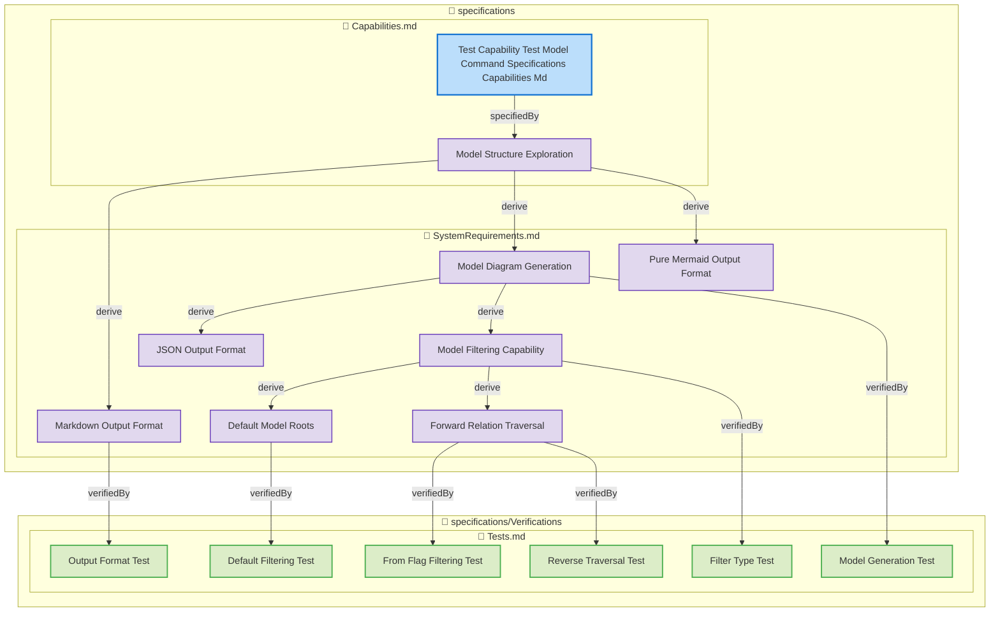

**Total Elements**: 2
**Total Relations**: 17
**Direction**: Forward

## [Model Command Ontology](specifications/Ontologies.md#model-command-ontology)

**Type**: ontology
**File**: [specifications/Ontologies.md](specifications/Ontologies.md)

## [Test Capability Test Model Command Specifications Capabilities Md](specifications/Capabilities.md#test-capability-test-model-command-specifications-capabilities-md)

**Type**: capability
**File**: [specifications/Capabilities.md](specifications/Capabilities.md)

