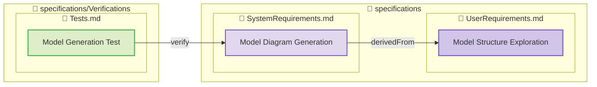

```mermaid
graph LR
  classDef userRequirement fill:#D1C4E9,stroke:#7E57C2,stroke-width:2px;
  classDef systemRequirement fill:#E1D8EE,stroke:#673AB7,stroke-width:1.5px;
  classDef verification fill:#DCEDC8,stroke:#4CAF50,stroke-width:2px;
  classDef default fill:#F5F5F5,stroke:#424242,stroke-width:1.5px;

  classDef folder fill:#FAFAFA,stroke:#9E9E9E,stroke-width:3px;
  classDef file fill:#FFF8E1,stroke:#FFCA28,stroke-width:2px;

  subgraph 9d68b769fcbc79d0["📁 specifications"]
    subgraph 77808752d543f615["📄 SystemRequirements.md"]
      f7eb2f9d9cd7bb11["Forward Relation Traversal"];
      class f7eb2f9d9cd7bb11 systemRequirement;
      click f7eb2f9d9cd7bb11 "specifications/SystemRequirements.md#forward-relation-traversal";
      b7ec4bb3813f1dea["Model Diagram Generation"];
      class b7ec4bb3813f1dea systemRequirement;
      click b7ec4bb3813f1dea "specifications/SystemRequirements.md#model-diagram-generation";
      836c732a54d7f48f["Model Filtering Capability"];
      class 836c732a54d7f48f systemRequirement;
      click 836c732a54d7f48f "specifications/SystemRequirements.md#model-filtering-capability";
    end
    subgraph 6e2c14866f0b0117["📄 UserRequirements.md"]
      906507e3072a273["Model Structure Exploration"];
      class 906507e3072a273 userRequirement;
      click 906507e3072a273 "specifications/UserRequirements.md#model-structure-exploration";
    end
  end
  subgraph 9f0649e759bd2822["📁 specifications/Verifications"]
    subgraph 7d9dffd79ed1d5b8["📄 Tests.md"]
      fb891ab92c9824aa["Reverse Traversal Test"];
      class fb891ab92c9824aa verification;
      click fb891ab92c9824aa "specifications/Verifications/Tests.md#reverse-traversal-test";
    end
  end
  fb891ab92c9824aa -->|verify| f7eb2f9d9cd7bb11;
  f7eb2f9d9cd7bb11 -->|derivedFrom| 836c732a54d7f48f;
  836c732a54d7f48f -->|derivedFrom| b7ec4bb3813f1dea;
  b7ec4bb3813f1dea -->|derivedFrom| 906507e3072a273;
```

**Total Elements**: 6
**Total Relations**: 14
**Direction**: Reverse
**Type Filter**: test-verification

## [Default Filtering Test](specifications/Verifications/Tests.md#default-filtering-test)

**Type**: test-verification
**File**: [specifications/Verifications/Tests.md](specifications/Verifications/Tests.md)

```mermaid
graph LR
  classDef userRequirement fill:#D1C4E9,stroke:#7E57C2,stroke-width:2px;
  classDef systemRequirement fill:#E1D8EE,stroke:#673AB7,stroke-width:1.5px;
  classDef verification fill:#DCEDC8,stroke:#4CAF50,stroke-width:2px;
  classDef default fill:#F5F5F5,stroke:#424242,stroke-width:1.5px;

  classDef folder fill:#FAFAFA,stroke:#9E9E9E,stroke-width:3px;
  classDef file fill:#FFF8E1,stroke:#FFCA28,stroke-width:2px;

  subgraph 9d68b769fcbc79d0["📁 specifications"]
    subgraph 77808752d543f615["📄 SystemRequirements.md"]
      6208b4add030277e["Default Root Filtering"];
      class 6208b4add030277e systemRequirement;
      click 6208b4add030277e "specifications/SystemRequirements.md#default-root-filtering";
      b7ec4bb3813f1dea["Model Diagram Generation"];
      class b7ec4bb3813f1dea systemRequirement;
      click b7ec4bb3813f1dea "specifications/SystemRequirements.md#model-diagram-generation";
      836c732a54d7f48f["Model Filtering Capability"];
      class 836c732a54d7f48f systemRequirement;
      click 836c732a54d7f48f "specifications/SystemRequirements.md#model-filtering-capability";
    end
    subgraph 6e2c14866f0b0117["📄 UserRequirements.md"]
      906507e3072a273["Model Structure Exploration"];
      class 906507e3072a273 userRequirement;
      click 906507e3072a273 "specifications/UserRequirements.md#model-structure-exploration";
    end
  end
  subgraph 9f0649e759bd2822["📁 specifications/Verifications"]
    subgraph 7d9dffd79ed1d5b8["📄 Tests.md"]
      a2368d1b4b67f0d7["Default Filtering Test"];
      class a2368d1b4b67f0d7 verification;
      click a2368d1b4b67f0d7 "specifications/Verifications/Tests.md#default-filtering-test";
    end
  end
  a2368d1b4b67f0d7 -->|verify| 6208b4add030277e;
  6208b4add030277e -->|derivedFrom| 836c732a54d7f48f;
  836c732a54d7f48f -->|derivedFrom| b7ec4bb3813f1dea;
  b7ec4bb3813f1dea -->|derivedFrom| 906507e3072a273;
```

## [Filter Type Test](specifications/Verifications/Tests.md#filter-type-test)

**Type**: test-verification
**File**: [specifications/Verifications/Tests.md](specifications/Verifications/Tests.md)

```mermaid
graph LR
  classDef userRequirement fill:#D1C4E9,stroke:#7E57C2,stroke-width:2px;
  classDef systemRequirement fill:#E1D8EE,stroke:#673AB7,stroke-width:1.5px;
  classDef verification fill:#DCEDC8,stroke:#4CAF50,stroke-width:2px;
  classDef default fill:#F5F5F5,stroke:#424242,stroke-width:1.5px;

  classDef folder fill:#FAFAFA,stroke:#9E9E9E,stroke-width:3px;
  classDef file fill:#FFF8E1,stroke:#FFCA28,stroke-width:2px;

  subgraph 9d68b769fcbc79d0["📁 specifications"]
    subgraph 77808752d543f615["📄 SystemRequirements.md"]
      b7ec4bb3813f1dea["Model Diagram Generation"];
      class b7ec4bb3813f1dea systemRequirement;
      click b7ec4bb3813f1dea "specifications/SystemRequirements.md#model-diagram-generation";
      836c732a54d7f48f["Model Filtering Capability"];
      class 836c732a54d7f48f systemRequirement;
      click 836c732a54d7f48f "specifications/SystemRequirements.md#model-filtering-capability";
    end
    subgraph 6e2c14866f0b0117["📄 UserRequirements.md"]
      906507e3072a273["Model Structure Exploration"];
      class 906507e3072a273 userRequirement;
      click 906507e3072a273 "specifications/UserRequirements.md#model-structure-exploration";
    end
  end
  subgraph 9f0649e759bd2822["📁 specifications/Verifications"]
    subgraph 7d9dffd79ed1d5b8["📄 Tests.md"]
      bbd610799ac8e00f["Filter Type Test"];
      class bbd610799ac8e00f verification;
      click bbd610799ac8e00f "specifications/Verifications/Tests.md#filter-type-test";
    end
  end
  bbd610799ac8e00f -->|verify| 836c732a54d7f48f;
  836c732a54d7f48f -->|derivedFrom| b7ec4bb3813f1dea;
  b7ec4bb3813f1dea -->|derivedFrom| 906507e3072a273;
```

## [From Flag Filtering Test](specifications/Verifications/Tests.md#from-flag-filtering-test)

**Type**: test-verification
**File**: [specifications/Verifications/Tests.md](specifications/Verifications/Tests.md)

```mermaid
graph LR
  classDef userRequirement fill:#D1C4E9,stroke:#7E57C2,stroke-width:2px;
  classDef systemRequirement fill:#E1D8EE,stroke:#673AB7,stroke-width:1.5px;
  classDef verification fill:#DCEDC8,stroke:#4CAF50,stroke-width:2px;
  classDef default fill:#F5F5F5,stroke:#424242,stroke-width:1.5px;

  classDef folder fill:#FAFAFA,stroke:#9E9E9E,stroke-width:3px;
  classDef file fill:#FFF8E1,stroke:#FFCA28,stroke-width:2px;

  subgraph 9d68b769fcbc79d0["📁 specifications"]
    subgraph 77808752d543f615["📄 SystemRequirements.md"]
      f7eb2f9d9cd7bb11["Forward Relation Traversal"];
      class f7eb2f9d9cd7bb11 systemRequirement;
      click f7eb2f9d9cd7bb11 "specifications/SystemRequirements.md#forward-relation-traversal";
      b7ec4bb3813f1dea["Model Diagram Generation"];
      class b7ec4bb3813f1dea systemRequirement;
      click b7ec4bb3813f1dea "specifications/SystemRequirements.md#model-diagram-generation";
      836c732a54d7f48f["Model Filtering Capability"];
      class 836c732a54d7f48f systemRequirement;
      click 836c732a54d7f48f "specifications/SystemRequirements.md#model-filtering-capability";
    end
    subgraph 6e2c14866f0b0117["📄 UserRequirements.md"]
      906507e3072a273["Model Structure Exploration"];
      class 906507e3072a273 userRequirement;
      click 906507e3072a273 "specifications/UserRequirements.md#model-structure-exploration";
    end
  end
  subgraph 9f0649e759bd2822["📁 specifications/Verifications"]
    subgraph 7d9dffd79ed1d5b8["📄 Tests.md"]
      293200814c46cd0d["From Flag Filtering Test"];
      class 293200814c46cd0d verification;
      click 293200814c46cd0d "specifications/Verifications/Tests.md#from-flag-filtering-test";
    end
  end
  293200814c46cd0d -->|verify| f7eb2f9d9cd7bb11;
  f7eb2f9d9cd7bb11 -->|derivedFrom| 836c732a54d7f48f;
  836c732a54d7f48f -->|derivedFrom| b7ec4bb3813f1dea;
  b7ec4bb3813f1dea -->|derivedFrom| 906507e3072a273;
```

## [Model Generation Test](specifications/Verifications/Tests.md#model-generation-test)

**Type**: test-verification
**File**: [specifications/Verifications/Tests.md](specifications/Verifications/Tests.md)

## [Output Format Test](specifications/Verifications/Tests.md#output-format-test)

**Type**: test-verification
**File**: [specifications/Verifications/Tests.md](specifications/Verifications/Tests.md)

```mermaid
graph LR
  classDef userRequirement fill:#D1C4E9,stroke:#7E57C2,stroke-width:2px;
  classDef systemRequirement fill:#E1D8EE,stroke:#673AB7,stroke-width:1.5px;
  classDef verification fill:#DCEDC8,stroke:#4CAF50,stroke-width:2px;
  classDef default fill:#F5F5F5,stroke:#424242,stroke-width:1.5px;

  classDef folder fill:#FAFAFA,stroke:#9E9E9E,stroke-width:3px;
  classDef file fill:#FFF8E1,stroke:#FFCA28,stroke-width:2px;

  subgraph 9d68b769fcbc79d0["📁 specifications"]
    subgraph 77808752d543f615["📄 SystemRequirements.md"]
      5abb4a3caae293d9["JSON Output Format"];
      class 5abb4a3caae293d9 systemRequirement;
      click 5abb4a3caae293d9 "specifications/SystemRequirements.md#json-output-format";
      25879bdc5e196bec["Markdown Output Format"];
      class 25879bdc5e196bec systemRequirement;
      click 25879bdc5e196bec "specifications/SystemRequirements.md#markdown-output-format";
      b7ec4bb3813f1dea["Model Diagram Generation"];
      class b7ec4bb3813f1dea systemRequirement;
      click b7ec4bb3813f1dea "specifications/SystemRequirements.md#model-diagram-generation";
    end
    subgraph 6e2c14866f0b0117["📄 UserRequirements.md"]
      906507e3072a273["Model Structure Exploration"];
      class 906507e3072a273 userRequirement;
      click 906507e3072a273 "specifications/UserRequirements.md#model-structure-exploration";
    end
  end
  subgraph 9f0649e759bd2822["📁 specifications/Verifications"]
    subgraph 7d9dffd79ed1d5b8["📄 Tests.md"]
      2f7b3b3deb29891d["Output Format Test"];
      class 2f7b3b3deb29891d verification;
      click 2f7b3b3deb29891d "specifications/Verifications/Tests.md#output-format-test";
    end
  end
  2f7b3b3deb29891d -->|verify| 5abb4a3caae293d9;
  5abb4a3caae293d9 -->|derivedFrom| b7ec4bb3813f1dea;
  b7ec4bb3813f1dea -->|derivedFrom| 906507e3072a273;
  2f7b3b3deb29891d -->|verify| 25879bdc5e196bec;
```

## [Reverse Traversal Test](specifications/Verifications/Tests.md#reverse-traversal-test)

**Type**: test-verification
**File**: [specifications/Verifications/Tests.md](specifications/Verifications/Tests.md)

