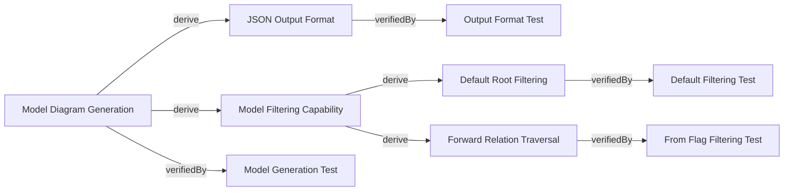

# Model Structure

**Total Elements**: 1
**Total Relations**: 9
**Filtered From**: Model Diagram Generation

## Model Diagram Generation

**Type**: requirement
**File**: [specifications/SystemRequirements.md](specifications/SystemRequirements.md)
**Section**: Visualization Commands

```mermaid
graph LR
  4f998d84bbf8f547["Model Diagram Generation"];
  f27d93928246808["JSON Output Format"];
  4f998d84bbf8f547 -->|derive| f27d93928246808;
  f27d93928246808["JSON Output Format"];
  8cc3b7ebaf3ea9b["Output Format Test"];
  f27d93928246808 -->|verifiedBy| 8cc3b7ebaf3ea9b;
  8cc3b7ebaf3ea9b["Output Format Test"];
  1ca5a7c02ab1c5f4["Model Filtering Capability"];
  4f998d84bbf8f547 -->|derive| 1ca5a7c02ab1c5f4;
  1ca5a7c02ab1c5f4["Model Filtering Capability"];
  5b114dac21ad2026["Default Root Filtering"];
  1ca5a7c02ab1c5f4 -->|derive| 5b114dac21ad2026;
  5b114dac21ad2026["Default Root Filtering"];
  c28803f3ded267fb["Default Filtering Test"];
  5b114dac21ad2026 -->|verifiedBy| c28803f3ded267fb;
  c28803f3ded267fb["Default Filtering Test"];
  46fbef5d552a5c01["Forward Relation Traversal"];
  1ca5a7c02ab1c5f4 -->|derive| 46fbef5d552a5c01;
  46fbef5d552a5c01["Forward Relation Traversal"];
  15d847f8ebf34901["From Flag Filtering Test"];
  46fbef5d552a5c01 -->|verifiedBy| 15d847f8ebf34901;
  15d847f8ebf34901["From Flag Filtering Test"];
  e80d22d575e02537["Model Generation Test"];
  4f998d84bbf8f547 -->|verifiedBy| e80d22d575e02537;
  e80d22d575e02537["Model Generation Test"];
```
