# Model Diagram Report

## 📁 specifications

### 📄 SystemRequirements.md

#### § Output Formatting

- **JSON Output Format** (requirement): `specifications/SystemRequirements.md#json-output-format`

#### § Visualization Commands

- **Forward Relation Traversal** (requirement): `specifications/SystemRequirements.md#forward-relation-traversal`
- **Model Diagram Generation** (requirement): `specifications/SystemRequirements.md#model-diagram-generation`
- **Model Filtering Capability** (requirement): `specifications/SystemRequirements.md#model-filtering-capability`

## 📁 specifications/Verifications

### 📄 Tests.md

#### § Model Command Tests

- **Model Filtering Test** (test-verification): `specifications/Verifications/Tests.md#model-filtering-test`
- **Model Generation Test** (test-verification): `specifications/Verifications/Tests.md#model-generation-test`
- **Output Format Test** (test-verification): `specifications/Verifications/Tests.md#output-format-test`

## Relations

- `specifications/SystemRequirements.md#forward-relation-traversal` verifiedBy `specifications/Verifications/Tests.md#model-filtering-test` (verifiedBy)
- `specifications/SystemRequirements.md#json-output-format` verifiedBy `specifications/Verifications/Tests.md#output-format-test` (verifiedBy)
- `specifications/SystemRequirements.md#model-diagram-generation` derive `specifications/SystemRequirements.md#json-output-format` (deriveReqT)
- `specifications/SystemRequirements.md#model-diagram-generation` derive `specifications/SystemRequirements.md#model-filtering-capability` (deriveReqT)
- `specifications/SystemRequirements.md#model-diagram-generation` verifiedBy `specifications/Verifications/Tests.md#model-generation-test` (verifiedBy)
- `specifications/SystemRequirements.md#model-filtering-capability` derive `specifications/SystemRequirements.md#forward-relation-traversal` (deriveReqT)
- `specifications/SystemRequirements.md#model-filtering-capability` verifiedBy `specifications/Verifications/Tests.md#model-filtering-test` (verifiedBy)

```mermaid
graph TD;
  %% REQVIRE-AUTOGENERATED-DIAGRAM
  %% Graph styling
  classDef userRequirement fill:#f9d6d6,stroke:#f55f5f,stroke-width:1px;
  classDef systemRequirement fill:#fce4e4,stroke:#e68a8a,stroke-width:1px;
  classDef verification fill:#d6f9d6,stroke:#5fd75f,stroke-width:1px;
  classDef folder fill:#f0f0f0,stroke:#666666,stroke-width:3px;
  classDef file fill:#ffffff,stroke:#999999,stroke-width:2px;
  classDef section fill:#fafafa,stroke:#aaaaaa,stroke-width:1px;
  classDef default fill:#f5f5f5,stroke:#333333,stroke-width:1px;

  subgraph e2822fc17b2fa7a1["📁 specifications"]
    subgraph 9945e4af79613c0d["📄 SystemRequirements.md"]
      subgraph 40e6c519bee7dbeb["§ Output Formatting"]
        f27d93928246808["JSON Output Format"];
        class f27d93928246808 systemRequirement;
        click f27d93928246808 "specifications/SystemRequirements.md#json-output-format";
      end
      subgraph eed7d1ef3e7c8b9c["§ Visualization Commands"]
        46fbef5d552a5c01["Forward Relation Traversal"];
        class 46fbef5d552a5c01 systemRequirement;
        click 46fbef5d552a5c01 "specifications/SystemRequirements.md#forward-relation-traversal";
        4f998d84bbf8f547["Model Diagram Generation"];
        class 4f998d84bbf8f547 systemRequirement;
        click 4f998d84bbf8f547 "specifications/SystemRequirements.md#model-diagram-generation";
        1ca5a7c02ab1c5f4["Model Filtering Capability"];
        class 1ca5a7c02ab1c5f4 systemRequirement;
        click 1ca5a7c02ab1c5f4 "specifications/SystemRequirements.md#model-filtering-capability";
      end
    end
  end
  subgraph 5c1b77ce400d632f["📁 specifications/Verifications"]
    subgraph cf533a32881d1680["📄 Tests.md"]
      subgraph f659c5a1fd1b9c32["§ Model Command Tests"]
        82b96aa538491c2b["Model Filtering Test"];
        class 82b96aa538491c2b verification;
        click 82b96aa538491c2b "specifications/Verifications/Tests.md#model-filtering-test";
        e80d22d575e02537["Model Generation Test"];
        class e80d22d575e02537 verification;
        click e80d22d575e02537 "specifications/Verifications/Tests.md#model-generation-test";
        8cc3b7ebaf3ea9b["Output Format Test"];
        class 8cc3b7ebaf3ea9b verification;
        click 8cc3b7ebaf3ea9b "specifications/Verifications/Tests.md#output-format-test";
      end
    end
  end
  46fbef5d552a5c01 -.->|verifiedBy| 82b96aa538491c2b;
  f27d93928246808 -.->|verifiedBy| 8cc3b7ebaf3ea9b;
  4f998d84bbf8f547 -.->|deriveReqT| f27d93928246808;
  4f998d84bbf8f547 -.->|deriveReqT| 1ca5a7c02ab1c5f4;
  4f998d84bbf8f547 -.->|verifiedBy| e80d22d575e02537;
  1ca5a7c02ab1c5f4 -.->|deriveReqT| 46fbef5d552a5c01;
  1ca5a7c02ab1c5f4 -.->|verifiedBy| 82b96aa538491c2b;
```

