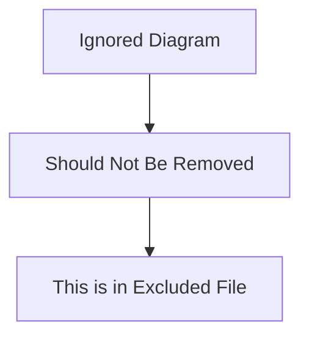
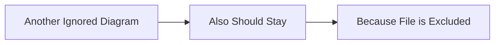

# Ignored File

This file should be ignored by Reqvire based on the configuration.

## Some Section

### Some Requirement

This looks like a real requirement but should be ignored.

#### Relations
  * verifiedBy: [Some Test](#some-test)

---

## Another Section

### Some Test

This verification should also be ignored.

#### Metadata
  * type: verification

---