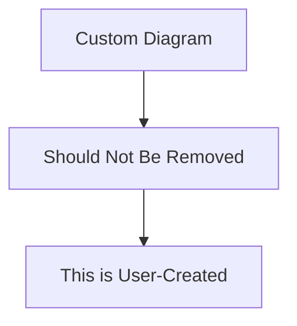

# Test Requirements

## Test Section
---

### Test Requirement

This is a test requirement to verify diagram removal functionality.

Here's a custom diagram that should be preserved:

#### Relations
  * verifiedBy: [Test Verification](#test-verification)

---

### Test Verification

This verification tests the requirement.

#### Metadata
  * type: verification

#### Relations
  * verify: [Test Requirement](#test-requirement)

---

## Another Section
---

### Another Requirement

This is another test requirement.

---