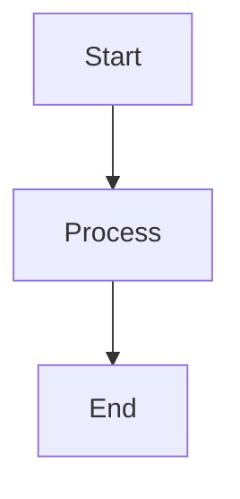

# Requirements

This document contains correctly formatted relations to existing targets, to verify validation passes.

This is page frontmatter content that should appear in the summary.

Additional page content to test mermaid diagram inclusion in page summaries.

### Verification of Standard Relations

#### Metadata
* type: test-verification

#### Relations
* verify: #requirement-with-valid-standard-relations
* verify: #requirement-with-valid-markdown-relations

---

### Requirement with Valid Standard Relations

This requirement has valid relations to existing files, using standard format.

#### Metadata
* type: user-requirement

#### Relations
* derivedFrom: Requirements.md#requirement-with-valid-markdown-relations
* satisfiedBy: DesignSpecifications/SampleDSD.md
* verifiedBy: [Verification of Standard Relations](#verification-of-standard-relations)
* verifiedBy: #search-command-verification

---

### Requirement with Valid Markdown Relations

This requirement has valid relations to existing files, using markdown link format.

#### Metadata
* type: user-requirement

#### Relations
* satisfiedBy: [./DesignSpecifications/SampleDSD.md](./DesignSpecifications/SampleDSD.md)
* trace: [Design Specification](DesignSpecifications/SampleDSD.md)
* verifiedBy: [Verification of Standard Relations](#verification-of-standard-relations)
* verifiedBy: #search-command-verification

---

### Requirement with DesignSpecifications Reference

This requirement specifically tests validation of relations to files in the DesignSpecifications folder.

#### Metadata
* type: requirement

#### Relations
* derivedFrom: #requirement-with-valid-standard-relations
* satisfiedBy: [Sample DSD](DesignSpecifications/SampleDSD.md)

---

### Requirement with Many Subsections

This requirement specifically tests validation of 'Other' subsections

#### Metadata
* type: user-requirement

#### Subsection 1

Some text of subsection 1

#### Subsection 2

Some text of subsection 2

---

### Search Command Verification

This test verifies that the search command supports all filter types and combines them with AND logic.

#### Details

##### Acceptance Criteria
- Search command accepts all documented filter flags
- Multiple filters combine with AND logic (results must match ALL filters)
- Invalid regex patterns produce clear error messages

##### Test Criteria
1. `reqvire search --json` returns valid JSON with all elements
2. `reqvire search --filter-type=user-requirement` returns only user-requirements
3. Element count with two filters is <= element count with one filter (additive behavior)

#### Metadata
  * type: test-verification

#### Relations
  * verify: #requirement-with-valid-standard-relations
  * verify: #requirement-with-valid-markdown-relations

---
