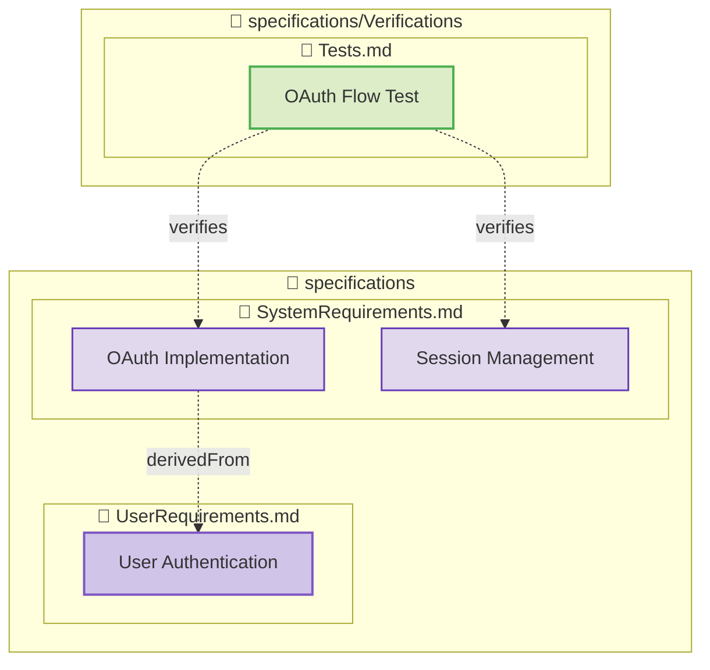
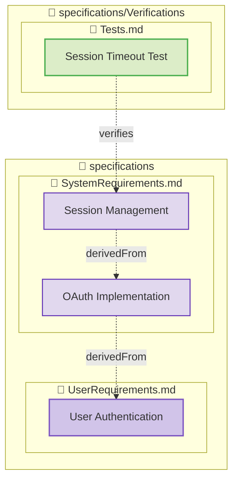
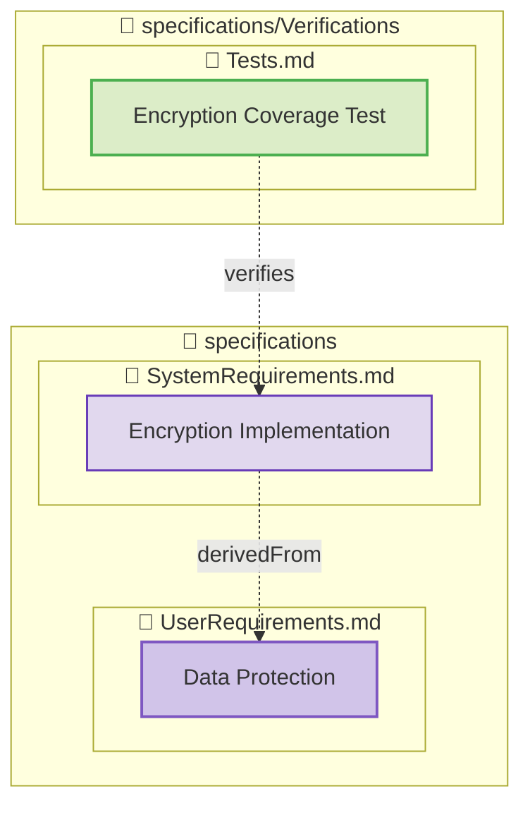
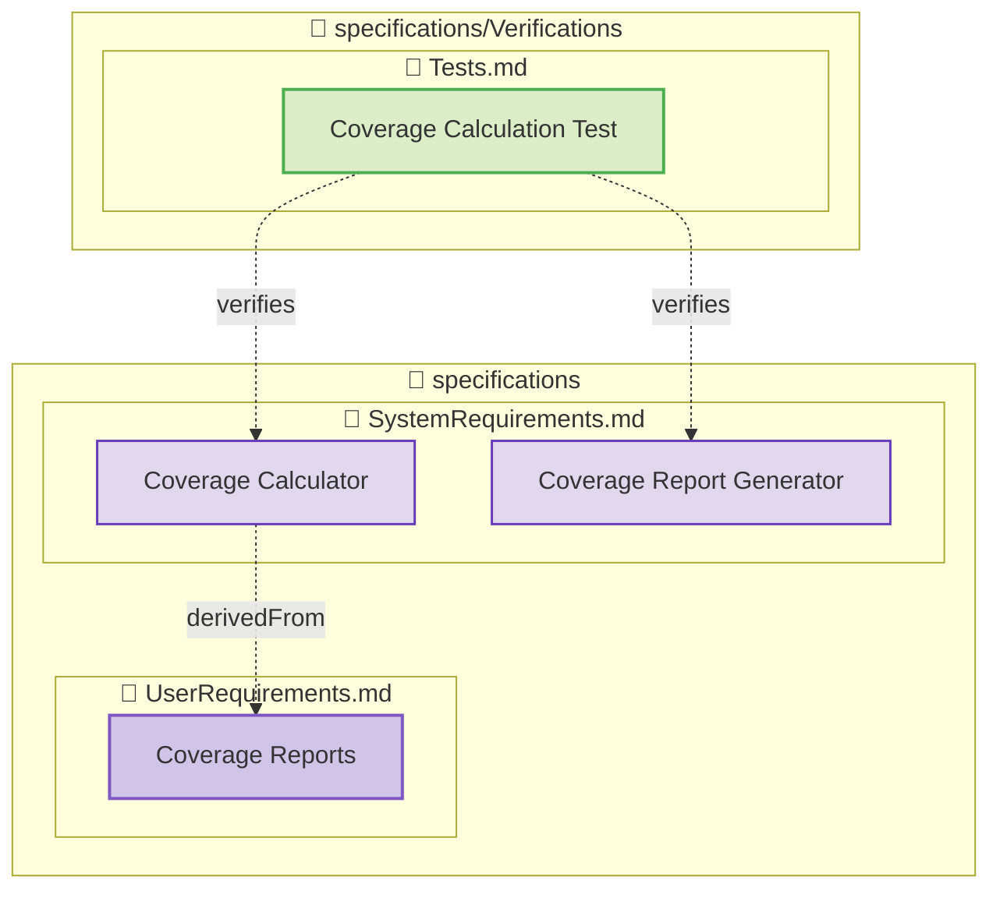
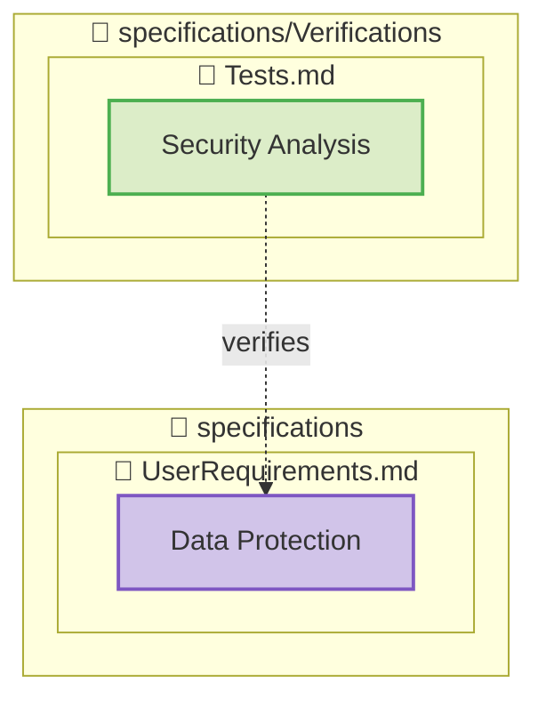
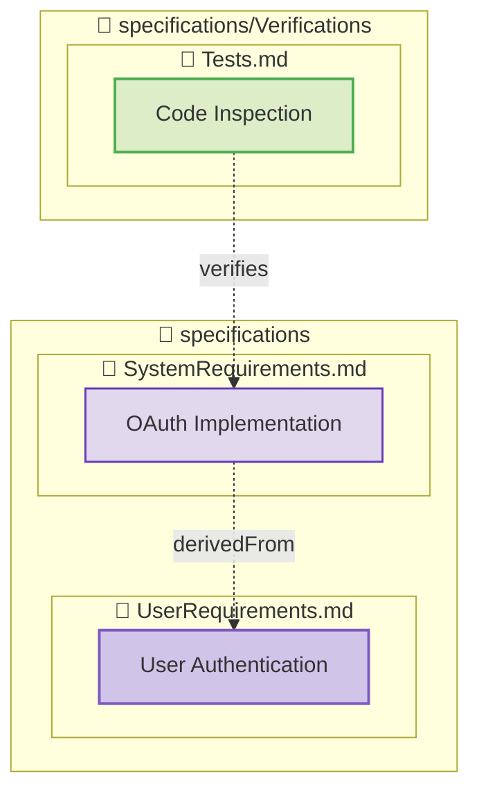

## File: specifications/Verifications/Tests.md

### [OAuth Flow Test](specifications/Verifications/Tests.md#oauth-flow-test)

- **Type**: test-verification
- **Directly Verified**: 2 requirements
- **Total in Tree**: 3 requirements

### [Session Timeout Test](specifications/Verifications/Tests.md#session-timeout-test)

- **Type**: test-verification
- **Directly Verified**: 1 requirements
- **Total in Tree**: 3 requirements

### [Encryption Coverage Test](specifications/Verifications/Tests.md#encryption-coverage-test)

- **Type**: test-verification
- **Directly Verified**: 1 requirements
- **Total in Tree**: 2 requirements

### [Coverage Calculation Test](specifications/Verifications/Tests.md#coverage-calculation-test)

- **Type**: test-verification
- **Directly Verified**: 2 requirements
- **Total in Tree**: 3 requirements

### [Security Analysis](specifications/Verifications/Tests.md#security-analysis)

- **Type**: analysis-verification
- **Directly Verified**: 1 requirements
- **Total in Tree**: 1 requirements

### [Code Inspection](specifications/Verifications/Tests.md#code-inspection)

- **Type**: inspection-verification
- **Directly Verified**: 1 requirements
- **Total in Tree**: 2 requirements

