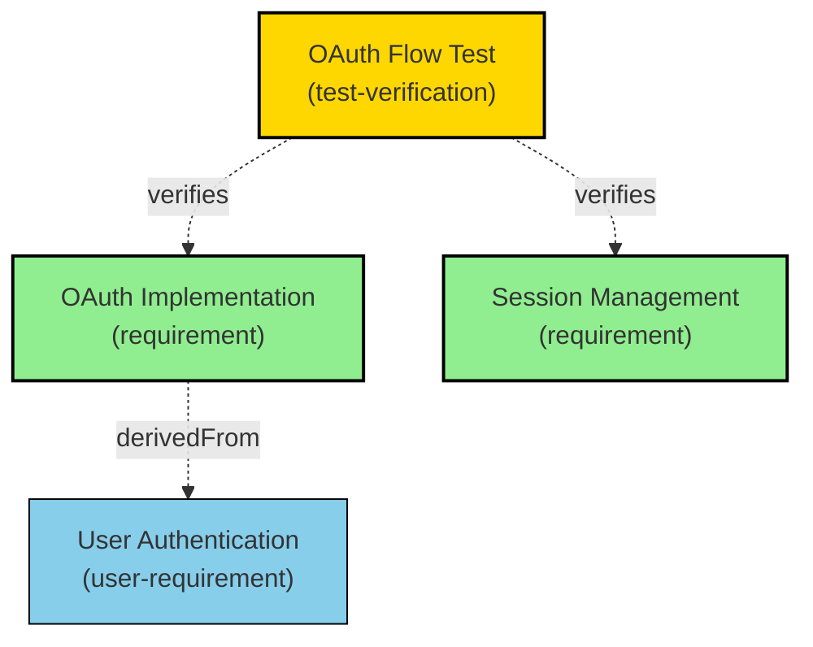
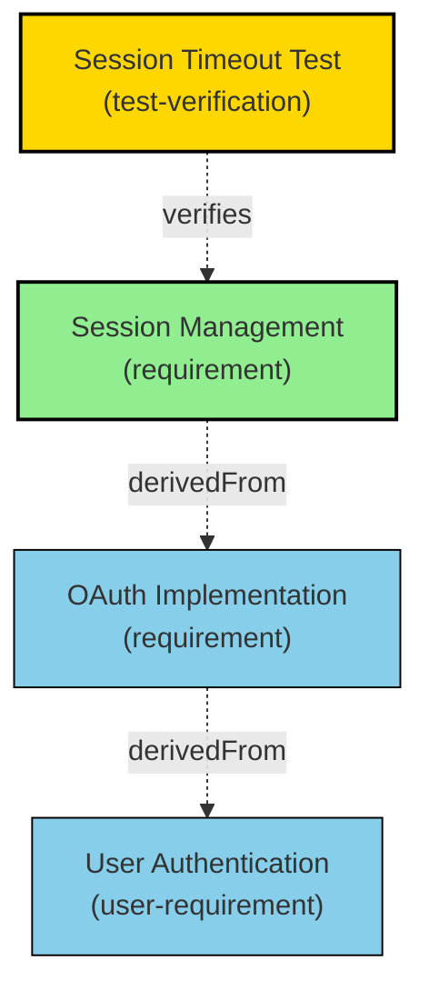
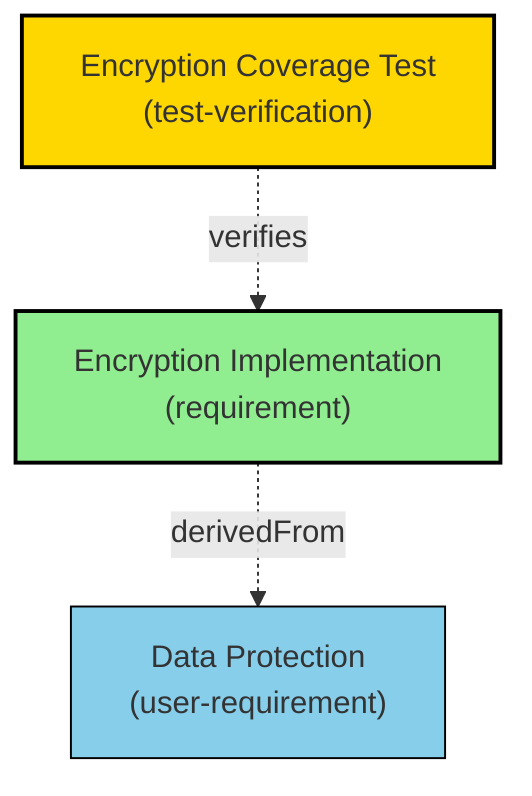
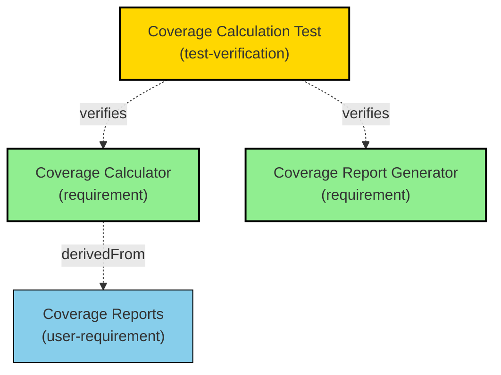
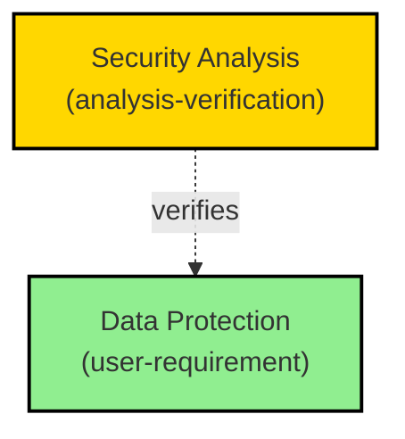
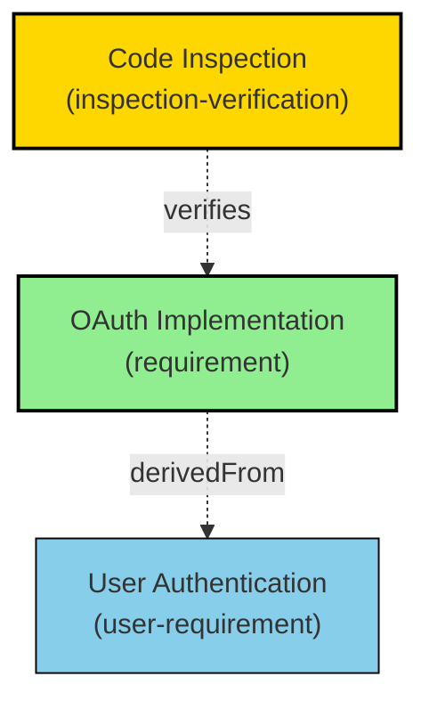

# Verification Traces Report

## File: specifications/Verifications/Tests.md

### Section: Authentication Tests

#### OAuth Flow Test

- **Type**: test-verification
- **Directly Verified**: 2 requirements
- **Total in Tree**: 3 requirements

**Redundant Relations:**
- [OAuth Implementation](specifications/SystemRequirements.md#oauth-implementation)

#### Session Timeout Test

- **Type**: test-verification
- **Directly Verified**: 1 requirements
- **Total in Tree**: 3 requirements

### Section: Security Tests

#### Encryption Coverage Test

- **Type**: test-verification
- **Directly Verified**: 1 requirements
- **Total in Tree**: 2 requirements

### Section: Coverage Tests

#### Coverage Calculation Test

- **Type**: test-verification
- **Directly Verified**: 2 requirements
- **Total in Tree**: 3 requirements

**Redundant Relations:**
- [Coverage Calculator](specifications/SystemRequirements.md#coverage-calculator)

### Section: Analysis Verifications

#### Security Analysis

- **Type**: analysis-verification
- **Directly Verified**: 1 requirements
- **Total in Tree**: 1 requirements

### Section: Inspection Verifications

#### Code Inspection

- **Type**: inspection-verification
- **Directly Verified**: 1 requirements
- **Total in Tree**: 2 requirements

